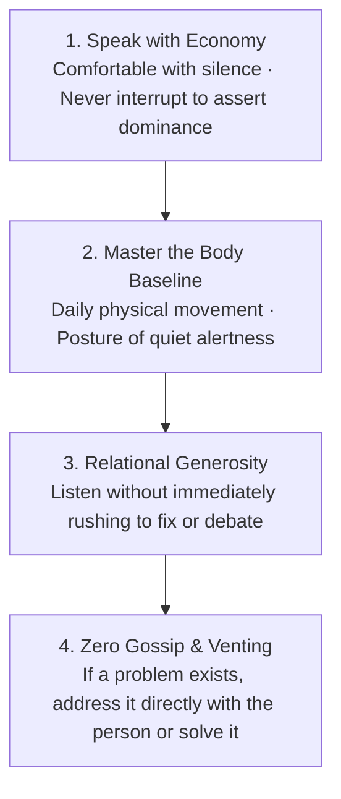

# Volume 6: Existential Sovereignty, Purpose & The Summit

## Chapter 31: The Architecture of Integrated Strength — Quiet Competence, Emotional Containment & Radical Ownership

In the modern world, the concept of masculine strength and mature character has been heavily distorted by two extreme caricatures:
1. **The Performative "Alpha" Posture**: Loud dominance games, emotional suppression, constant status signaling, and a desperate refusal to admit error.
2. **The Passive Reactive State**: Chronic hypersensitivity, lack of personal agency, paralysis of purpose, and an externalized victim mindset.

In the philosophy of human excellence and mature psychology, true power lies in **Integrated Strength**: the state of being physically disciplined, professionally competent, emotionally self-contained, and radically accountable.

When you master the **Code of Integrated Strength**, you stop seeking external validation, eliminate interpersonal defensiveness, and become an unshakeable stabilizing anchor for yourself and those around you.

---

### The Spectrum of Character & Maturity

```mermaid
graph TD
    subgraph 1. The Performative Posturer
        P1[Loud Status Signaling & Domination Games]
        --> P2[Fragile Ego Armor · Zero Vulnerability]
        --> P3[Blames Others upon Failure · Chronic Insecurity]
    end

    subgraph 2. The Passive Reactive State
        R1[Lack of Agency · Drifting without Purpose]
        --> R2[Boundaryless Emotional Venting]
        --> R3[Victim Mindset · Paralyzed by External Chaos]
    end

    subgraph 3. The Integrated Sovereign
        I1[Quiet Competence · Action Speaks for Itself]
        --> I2[Emotional Containment · Poise Under Pressure]
        --> I3[Radical Ownership · Stabilizing Anchor for Others]
    end
```



---

### The Four Pillars of Integrated Strength

---

#### 1. Quiet Competence (Action Over Advertising)
* **The Principle**: The loudest person in the room is almost universally the most insecure. A man who truly knows how to execute never needs to boast about his plans, announce his workouts, or post constant proofs of success.
* **The Rule**: **Let your craft speak; let your ego whisper.** Execute your daily blocks in silence. Real competence creates a gravitational field of respect that requires zero self-promotion.

---

#### 2. Emotional Containment vs. Repression
* **The Misconception**: Traditional culture taught men to repress emotions until they exploded into rage or burnout. Modern pop-culture often swings to the other extreme, encouraging raw, unfiltered emotional dumping onto others.
* **The Mature Truth**: **Containment is not repression; containment is emotional self-possession.**
  * You feel anger, grief, fear, or frustration with complete conscious awareness.
  * However, you maintain the metacognitive discipline not to let transient emotional storms dictate your speech or derail your actions. You absorb turbulence and emit calm clarity.

```mermaid
graph LR
    subgraph Repression (Toxic)
        A1[Pain / Stress] --> A2[Subconscious Denial] --> A3[Erupts as Rage or Depression]
    end

    subgraph Containment (Mastery)
        B1[Pain / Stress] --> B2[Conscious Observation & Labeling] --> B3[Channeled into Focused Craft & Calm Speech]
    end
```

---

#### 3. The Dignity of Radical Ownership
* **The Habit of the Weak**: Making defensive excuses when a project fails, a deadline is missed, or a relationship encounters friction (*"The traffic was terrible," "The instructions were unclear," "They provoked me"*).
* **The Code of Ownership**: The moment an error occurs, eliminate all defensiveness immediately.
  * State plainly: *"That was my responsibility. Here is exactly where the system broke down, and here is the concrete step I am taking right now to fix it."*
  * Taking 100% ownership instantly dissolves interpersonal conflict, commands undeniable respect, and gives you complete power to correct the outcome.

---

#### 4. The Stabilizing Anchor (The Service Orientation)
* **The Mindset Shift**: An immature individual enters a room asking: *"How can I impress these people and extract status?"*
* **The Sovereign Approach**: An integrated individual enters a room asking: **"How can I bring order, clarity, safety, and composure to this space?"**
  * In moments of organizational panic or family stress, they do not add to the noise; they lower the collective blood pressure of the room through grounded presence, active listening, and decisive action.

---

### The Daily Code of Conduct (Actionable Heuristics)



1. **Speak with Economy**: Do not rush to fill silent pauses. Speak deliberately, say what you mean, and listen twice as much as you talk.
2. **Master the Physical Baseline**: Treat your physical body as a temple of duty. Daily physical conditioning, clean nutrition, and upright posture are not for cosmetic vanity; they are the physical foundation of mental fortitude.
3. **Listen Before Solving**: When someone brings you an emotional struggle, resist the urge to immediately lecture or solve. First, hold space and validate their reality with complete presence.
4. **Zero Gossip and Venting**: High-character individuals never discuss other people behind their backs. If there is a problem, address it directly with dignity, or build a constructive solution in silence.

---

### The Core Takeaway to Remember
> True strength is not the ability to dominate others; it is the absolute mastery of oneself. Shed the loud posturing and the fragile excuses. Cultivate quiet competence in your craft, contain your emotional storms with poise, take radical ownership of every outcome, and become an unshakeable pillar of peace in a noisy world.
