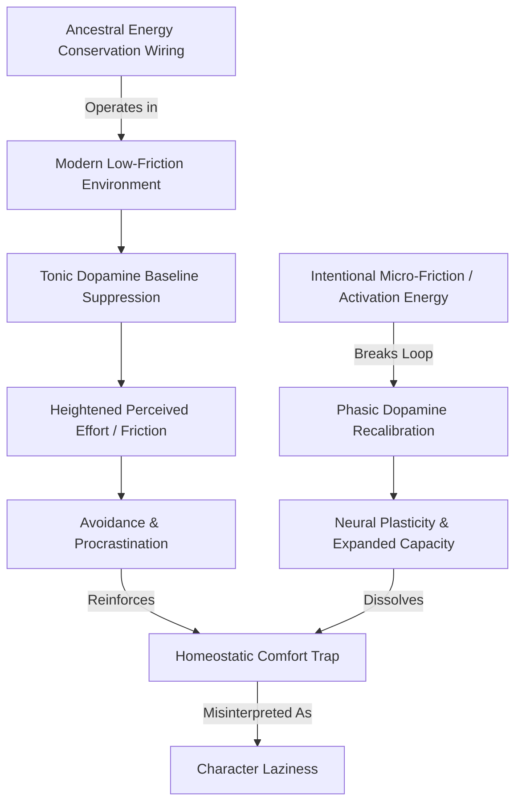

# Node: Cognitive Energy Conservation & The Homeostatic Comfort Trap

> **First-Principles Kernel**: The mammalian central nervous system evolved as an energy-conserving prediction engine optimized to minimize metabolic caloric expenditure in ancestral scarcity environments; in modern hyper-abundant, low-friction conditions, this adaptive homeostatic inertia manifests as chronic paralysis and avoidance—frequently misdiagnosed as moral or character "laziness."
> **Source**: *You’re Not Lazy — Your Comfort Zone Is Killing You* (ABrainoConscious, YouTube)
> **Tree Coordinates**: `Roots > Volume 05: Society, Money & Mind > Neurobiology & Cognitive Mechanics`
> **Evidence Status**: `Verified & Epistemically Audited`

---

## 1. The Core Thesis & Perspective

- **Speaker's Core Thesis**: Inaction, procrastination, and persistent avoidance of ambitious tasks are rarely moral deficiencies or lack of willpower ("laziness"). Rather, they are the functional output of a neurobiological system operating strictly within its biological comfort equilibrium—a state where the brain seeks to protect metabolic reserves and avoid the uncertainty costs of novel action.
- **The Paradox of the Modern Comfort Zone**: The human brain consumes ~20% of resting metabolic energy despite accounting for only ~2% of body mass. In ancestral environments, expending voluntary energy without an immediate, guaranteed caloric or reproductive return threatened survival. Staying within familiar routines ("the comfort zone") was an optimal survival strategy. In the modern world, where survival is largely guaranteed and high-value outcomes require voluntary exploration and friction, this energy-conservation architecture turns into a self-reinforcing stagnation trap.
- **Unique Framing**: The comfort zone is not a cozy emotional sanctuary; it is a metabolic and predictive local minimum—a gravity well of low friction that steadily erodes dopamine baseline sensitivity and neural plasticity.

---

## 2. First-Principles Deconstruction

### A. The Axiomatic Foundation
1. **Metabolic Caloric Minimization**: Neural computation is metabolically expensive (action potentials, neurotransmitter recycling, synaptic remodeling). The default state of the organism is to minimize unprovoked voluntary effort unless compelled by acute deficit or salient reward gradients.
2. **Predictive Processing & Error Minimization**: The brain continuously predicts incoming sensory inputs (Karl Friston’s Free Energy Principle). Novel environments and unfamiliar actions generate high prediction errors and uncertainty, triggering amygdala threat responses and cortisol release, which the nervous system seeks to dampen by returning to habitual states.
3. **Dopamine Baseline Homeostasis**: Dopamine is not the molecule of pleasure; it is the molecule of anticipated reward, motivation, and energetic mobilization. In a state of chronic comfort and low-friction digital stimulation, baseline dopamine downregulates, raising the threshold of perceived effort required to initiate action.

### B. Step-by-Step Mechanics of the Comfort Trap

```text
Low-Risk Routine (Habitual State)
        ↓
Zero Prediction Error & Minimal Caloric Cost (Brain perceives safety)
        ↓
Desensitization of Tonic Dopamine Baselines (Heightened perceived effort)
        ↓
Any Novel or Ambitious Task Generates Resistance (Friction perceived as threat)
        ↓
Retreat into Familiar Distraction / Inaction (Negative Reinforcement Loop)
        ↓
Misattribution: "I am inherently lazy" (Cognitive Distortion / Learned Helplessness)
```

### C. Counter-Intuitive Truths
* **Motivation does not precede action; it is a downstream byproduct of action.** Waiting for "motivation" before leaving the comfort zone is biologically backwards; the dopamine spike occurs *after* the initial activation energy barrier is crossed.
* **Comfort produces anxiety, not peace.** Prolonged confinement to an under-stimulating comfort zone degrades the nervous system's stress tolerance (allostatic load capacity), making minor daily frictions feel overwhelming.

---

## 3. Senior Auditor Annotations & Scientific Gap-Fulfillment

> [!NOTE]
> **Auditor Commentary & Academic Foundations**:
> The speaker's thesis aligns directly with modern computational neuroscience, specifically the **Free Energy Principle** (Karl Friston) and **Optimal Foraging Theory** (MacArthur & Pianka). In nature, an animal that burns energy exploring barren terrain starves. The modern environment decouples effort from survival, creating a biological mismatch.

* **Supporting Scientific Literature**:
  1. **Friston, K. (2010)**: *The free-energy principle: a unified brain theory?* — Nature Reviews Neuroscience. Demonstrates that biological systems minimize variational free energy (surprise/uncertainty) by restricting their state-space to habitual, predictable regimes.
  2. **Salamone, J. D. & Correa, M. (2012)**: *The mysterious motivational functions of mesolimbic dopamine* — Neuron. Proves dopamine regulates effort-related choice behavior (willingness to overcome energetic barriers) rather than passive hedonic pleasure.
  3. **Huberman, A. (2021)**: *Dopamine reward prediction error and tonic vs. phasic release* — Stanford Neurobiology. Explains how high-frequency, low-effort dopamine spikes (social media, ultra-processed food) depress the tonic baseline, making real-world cognitive work feel exponentially harder.

---

## 4. Visual Concept Map



---

## 5. Actionable Heuristics & Mental Models

1. **The Thermodynamic Activation Energy Heuristic ($E_a$)**:
   - *Rule*: Treat procrastination not as a moral flaw, but as a high kinetic energy barrier (analogous to the Arrhenius activation energy in chemistry). Lower the barrier to initiation to near-zero (e.g., "Work for 2 minutes" or "Open the document and write 1 sentence"). Once the reaction begins, the enthalpy of momentum maintains the process.
2. **The Friction Inversion Diagnostic**:
   - *Diagnostic Check*: *"Am I avoiding this task because it is dangerous, or simply because my brain is trying to conserve metabolic calories in the face of temporary uncertainty?"* If the latter, acknowledge the evolutionary false alarm and proceed.
3. **Dopamine Baseline Reset**:
   - *Rule*: Restrict high-dopamine, low-effort reward inputs (scrolling, passive media) before high-cognitive-demand tasks to preserve dopamine receptor sensitivity and effort tolerance.

---

## 6. Tree Linkages & Cross-Domain Bridges

- **Roots To**: 
  - [[entropy]]: Closed thermodynamic systems gravitate toward maximum entropy/equilibrium unless maintained by continuous work and energy throughput.
  - [[feedback-loops]]: Homeostasis relies on negative feedback to preserve existing setpoints, resisting state changes.
  - [[needs-and-incentives]]: Human action is governed by expected utility and perceived cost-benefit payoff gradients.
- **Lateral Bridge**: 
  - **Chemistry $\longleftrightarrow$ Cognitive Science**: *Arrhenius Activation Energy $\longleftrightarrow$ Behavioral Activation Threshold*. In both chemical reactions and human behavior, the primary obstacle is not the total reaction energy, but the initial barrier required to transition into the active state.
