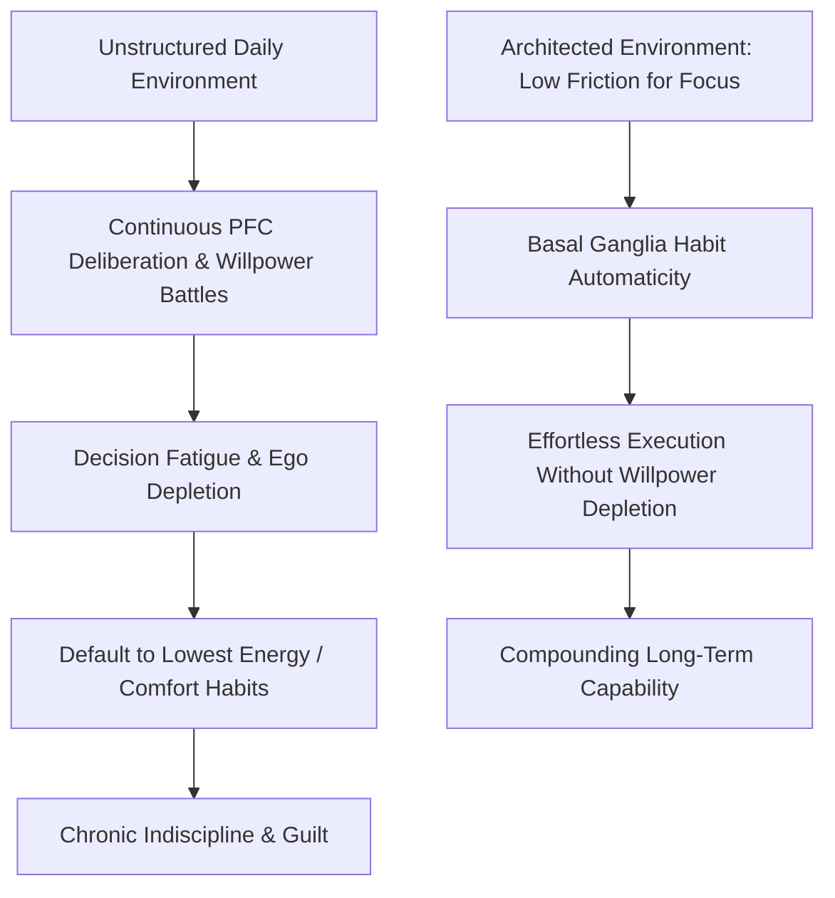

# Node: Executive Friction, Prefrontal Load & Habit Automaticity

> **First-Principles Kernel**: Conscious willpower is an energy-intensive, finite executive function mediated by the prefrontal cortex (PFC); sustainable discipline is achieved not through continuous willpower battles, but by designing low-friction behavioral architectures that offload cognitive routines to the basal ganglia (automaticity).
> **Source**: *Indiscipline Is Slowly Killing Your Life* (ABrainoConscious, YouTube: [`3nDjfpTJSD4`](https://youtu.be/3nDjfpTJSD4)) / Roy Baumeister (*Ego Depletion*) & Ann Graybiel (*Basal Ganglia Habit Chunking*).
> **Tree Coordinates**: `Roots > Volume 05: Society, Money & Mind > Neurobiology & Cognitive Mechanics`
> **Evidence Status**: `Verified & Epistemically Audited`

---

## 1. The Expert Perspective & Core Thesis

- **The Willpower Fallacy**: Relying on conscious willpower ("gritting your teeth") to maintain daily discipline is a biologically flawed strategy. The prefrontal cortex (PFC) has a strictly limited capacity for continuous inhibition and deliberate decision-making.
- **The True Nature of "Disciplined" People**: Highly productive and disciplined individuals do not possess superhuman willpower; they architect their environment and routines to **minimize choice friction** so that constructive actions become the path of least resistance.

---

## 2. First-Principles Deconstruction: PFC vs. Basal Ganglia

```text
Deliberate Choice (PFC Supervised)
  ├── High metabolic glucose/oxygen consumption
  ├── Prone to decision fatigue & emotional interference
  └── Fragile under stress / sleep deprivation
        ↓ [Repetition + Consistent Context Cues]
Habit Chunking (Basal Ganglia Automated)
  ├── Near-zero cognitive/metabolic overhead
  ├── Operates autonomously without conscious deliberation
  └── Resilient against fatigue and fluctuating mood
```

---

## 3. The 3 Architectural Pillars of Sustainable Discipline

1. **Choice Friction Engineering**:
   - *Positive Friction*: Add friction to bad habits (e.g. phone outside the bedroom, browser blockers).
   - *Negative Friction*: Reduce the physical and cognitive friction of good habits to near-zero (e.g. workspace prepared the night before).
2. **The 3-Second Action Window (Amygdala Bypass)**:
   - When an intention is formed, act within 3 seconds before the prefrontal cortex begins rationalizing comfort-preserving excuses and energy-conservation avoidance.
3. **Identity-Level Setpoint Adjustment**:
   - Shift focus from outcome goals (*"I need to write 1000 words"*) to identity defaults (*"I am a person who writes every morning at 8:00 AM"*). This eliminates the internal deliberation conflict.

---

## 4. Visual Concept Map



---

## 5. Cross-Domain Bridges & Isomorphisms

* **Computer Architecture $\longleftrightarrow$ Neurobiology**:
  - **CPU vs. ASIC / Dedicated Hardware $\longleftrightarrow$ Prefrontal Cortex vs. Basal Ganglia**: The Prefrontal Cortex functions like a general-purpose CPU—flexible and programmable, but power-hungry and easily bottlenecked. The Basal Ganglia functions like a dedicated Application-Specific Integrated Circuit (ASIC)—hardwired for single routines (habits), executing them with near-zero latency and minimal energy draw.
* **Physics & Friction $\longleftrightarrow$ Habit Formation**:
  - **Static vs. Kinetic Friction**: The effort required to initiate an action from rest ($F_{\text{static}}$) is significantly higher than the effort to keep moving ($F_{\text{kinetic}}$). Overcoming initial static friction transitions the brain into kinematic momentum.

---

## 6. Actionable Heuristics

1. **The Zero-Deliberation Rule**:
   - Never leave the initiation of a key daily habit up for morning debate. Schedule the exact time, location, and pre-staged tools in advance.
2. **The Anti-Friction Audit**:
   - Identify the single physical obstacle causing task delay (e.g., locating files, cluttered desk) and eliminate it prior to session start.
