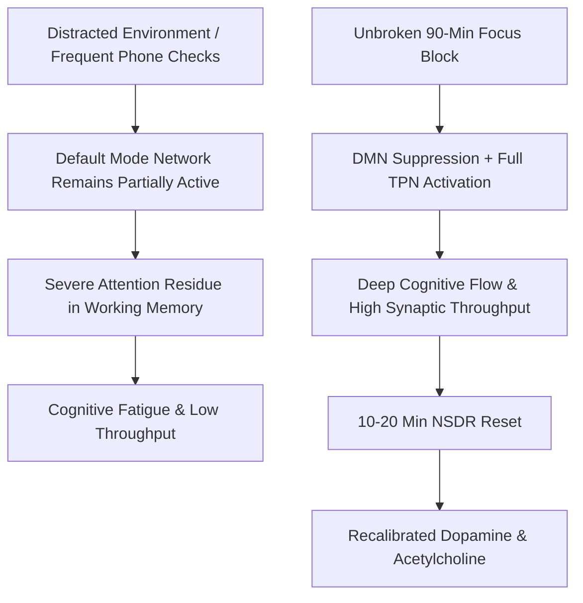

# Node: Neurobiology of Deep Focus, Attention Residue & Network Toggling

> **First-Principles Kernel**: Attentional focus is the biological suppression of the Default Mode Network (DMN) in favor of the Task-Positive Network (TPN); context-switching leaves metabolic "attention residue" in working memory that degrades cognitive throughput and prefrontal executive function.
> **Source**: *How To Build Deep Focus In a Distracted Brain* (ABrainoConscious, YouTube: [`JZU4L_u72T8`](https://youtu.be/JZU4L_u72T8)) / Dr. Sophie Leroy (*Attention Residue*) & Cal Newport (*Deep Work*).
> **Tree Coordinates**: `Roots > Volume 05: Society, Money & Mind > Neurobiology & Cognitive Mechanics`
> **Evidence Status**: `Verified & Epistemically Audited`

---

## 1. The Expert Perspective & Core Thesis

- **The Myth of Multitasking**: The human brain does not possess parallel execution capabilities for complex cognitive tasks. What is colloquially called "multitasking" is rapid, high-cost context-switching.
- **Attention Residue**: When you transition from Task A to Task B (even for a "quick check" of an email or notification), a portion of your cognitive resources remains allocated to Task A. This residual load fragments working memory and severely impairs deep problem-solving capability.

---

## 2. First-Principles Deconstruction: DMN vs. TPN

```text
Default Mode Network (DMN)
  ├── Medial prefrontal cortex & posterior cingulate cortex
  ├── Governs self-referential thought, daydreaming, social simulation, and anxiety
  └── Highly active during boredom, passive scrolling, and fragmented states
            ▲
            │ (Mutually Antagonistic Anti-Correlation)
            ▼
Task-Positive Network (TPN)
  ├── Dorsolateral prefrontal cortex & dorsal attention network
  ├── Governs goal-directed, externally focused computational work
  └── Requires continuous unfragmented focus to reach flow equilibrium
```

---

## 3. The 4 Neurobiological Pillars of Deep Focus

1. **Dopamine Loading Sequence**:
   - Never consume high-dopamine, zero-effort rewards (social feeds, news, notifications) during the first 60–90 minutes of waking. Preserving a low-stimulation baseline prevents premature dopamine downregulation before deep work.
2. **Context-Switching Minimization**:
   - Deep work requires a minimum of 20–25 minutes of unbroken single-task execution to clear previous attention residue and fully activate the Task-Positive Network.
3. **Non-Sleep Deep Rest (NSDR)**:
   - When cognitive fatigue occurs after a 90-minute ultradian focus cycle, use a 10–20 minute NSDR (Yoga Nidra / zero-input state) to reset acetylcholine and dopamine stores.
4. **The Implementation Intentions (If-Then Automation)**:
   - *"If it is 09:00 AM, then I close all tabs and open the code repository."* Pre-commitments eliminate prefrontal deliberation.

---

## 4. Visual Concept Map



---

## 5. Cross-Domain Bridges & Isomorphisms

* **Computer Architecture $\longleftrightarrow$ Cognitive Neuroscience**:
  - **CPU Context Switching & Cache Invalidation $\longleftrightarrow$ Attention Residue in Working Memory**: In operating systems, switching execution threads forces the CPU to save state, flush L1/L2 caches, and reload memory registers—costing substantial CPU cycles (thrashing). In the human brain, switching tasks invalidates the working memory buffer, causing cognitive thrashing.
* **Thermodynamics $\longleftrightarrow$ Cognitive Load**:
  - **Thermodynamic Reversibility $\longleftrightarrow$ Undivided Focus**: Frequent interruptions represent irreversible dissipative losses of metabolic energy that cannot be reclaimed without rest.

---

## 6. Actionable Heuristics

1. **The 90-Minute Ultradian Focus Limit**:
   - Align deep work with natural biological ultradian rhythms (90 minutes max sustained focus followed by 15–20 minutes of disengaged rest).
2. **The Zero-Interruption Rule**:
   - A 5-second check of a notification does not cost 5 seconds; it costs 15–20 minutes of attention residue before full TPN re-engagement.
