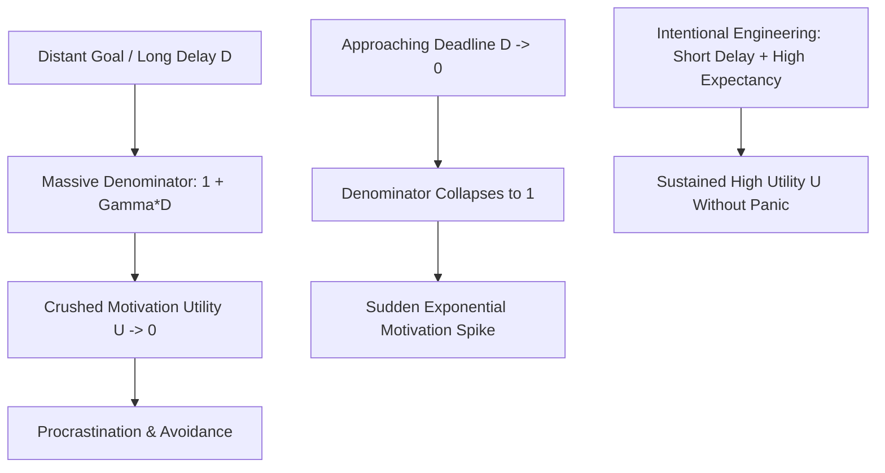

# Node: Temporal Motivation Theory & The Procrastination Formula

> **First-Principles Kernel**: Human motivational utility ($U$) is not fixed; it is dynamically governed by the product of perceived self-efficacy and subjective reward value, hyperbolically discounted by the delay until realization modulated by individual impulsiveness sensitivity:
> $$\text{Utility} = \frac{E \times V}{1 + \Gamma \times D}$$
> **Source**: *Formula That Ends Procrastination* (ABrainoConscious, YouTube) / Dr. Piers Steel & Cornelius König (*Temporal Motivation Theory*, Psychological Bulletin 2006).
> **Tree Coordinates**: `Roots > Volume 05: Society, Money & Mind > Decision Theory & Cognitive Mechanics`
> **Evidence Status**: `Verified & Epistemically Audited`

---

## 1. The Expert Perspective & Core Thesis

- **The Myth of Willpower**: Procrastination is not a moral character defect or lack of discipline. It is the predictable mathematical result of **hyperbolic time discounting**—the evolutionary bias to discount future rewards exponentially in favor of immediate, low-latency payoffs.
- **The Core Dynamic**: When an assignment or goal has a distant deadline ($D \gg 0$), the denominator ($1 + \Gamma D$) is enormous, crushing the net motivational utility ($U \approx 0$). As the deadline approaches ($D \to 0$), the denominator collapses, creating an exponential spike in motivation hours before the deadline (the "all-nighter panic spike").

---

## 2. First-Principles Deconstruction & Mathematical Model

### A. The Temporal Motivation Theory (TMT) Equation

$$\text{Motivation Utility } (U) = \frac{E \times V}{1 + \Gamma \times D}$$

| Variable | Cognitive / Mathematical Meaning | Leverage Point |
| :--- | :--- | :--- |
| **$E$ (Expectancy)** | Subjective confidence / probability of successful completion ($0 \le E \le 1$). | Break the task into micro-steps so success probability approaches $1.0$. |
| **$V$ (Value)** | Subjective magnitude or intrinsic/extrinsic reward of the outcome. | Increase emotional clarity, curiosity, or financial/intellectual payoff. |
| **$\Gamma$ (Impulsiveness / Sensitivity)** | Individual susceptibility to distraction and delay discounting rate. | Remove environmental cues, phone notifications, and low-friction temptations. |
| **$D$ (Delay)** | Perceived time duration remaining until the reward/consequence is realized. | Set synthetic short-term milestones (e.g., 25-minute Pomodoro, end-of-day sprint). |

---

## 3. Senior Auditor Annotations & Gap-Fulfillment

> [!NOTE]
> **Auditor Commentary**:
> Temporal Motivation Theory synthesized four major psychological frameworks:
> 1. **Expectancy Theory (Vroom, 1964)**: Motivation depends on expected competence.
> 2. **Cumulative Prospect Theory (Kahneman & Tversky, 1992)**: Asymmetric weighting of losses vs. gains.
> 3. **Hyperbolic Discounting (Ainslie, 1992)**: Reward devaluation over time is non-linear ($1/(1+kD)$).
> 4. **Need Theory (Locke & Latham, 1990)**: Goal specificity elevates perceived value.

* **Key Boundary Condition**: If Expectancy ($E$) is near zero (e.g., impostor syndrome or paralyzing confusion), no amount of deadline pressure will create flow; it produces avoidance panic or paralysis.

---

## 4. Visual Concept Map

---

## 5. Actionable Heuristics & Decision Rules

1. **The Denominator Collapse Heuristic (Artificial Delay Compression)**:
   - *Rule*: When faced with a multi-month project, never schedule against the final deadline. Split the deliverable into daily 24-hour sprints ($D \le 1\text{ day}$) so the denominator remains minimal throughout the project lifecycle.
2. **The Expectancy Repair Rule**:
   - *Diagnostic*: If a task feels impossible to start despite high value ($V$), the breakdown is in Expectancy ($E$). Define the single smallest physical action (e.g. "Draft 3 bullet points") to raise $E \to 1.0$.
3. **The Environmental $\Gamma$-Suppression Protocol**:
   - *Rule*: Reduce impulsiveness parameter $\Gamma$ by physically increasing the friction of distractions (e.g. phone in another room, site blockers).

---

## 6. Cross-Domain Bridges & Isomorphisms

- **Roots To**: 
  - [[needs-and-incentives]]: Expected utility optimization and reward payoffs.
  - [[cognitive-energy-conservation-comfort-trap]]: Brain conserving metabolic energy when perceived delay is long.
- **Lateral Bridge**: 
  - **Economics & Finance $\longleftrightarrow$ Psychology**: *Net Present Value (NPV) Discounting $\longleftrightarrow$ Temporal Motivation Theory*. In finance, a dollar received 10 years from now is discounted by $1/(1+r)^t$. The human nervous system executes an analogous hyperbolic discounting calculation on the subjective utility of future accomplishments.
