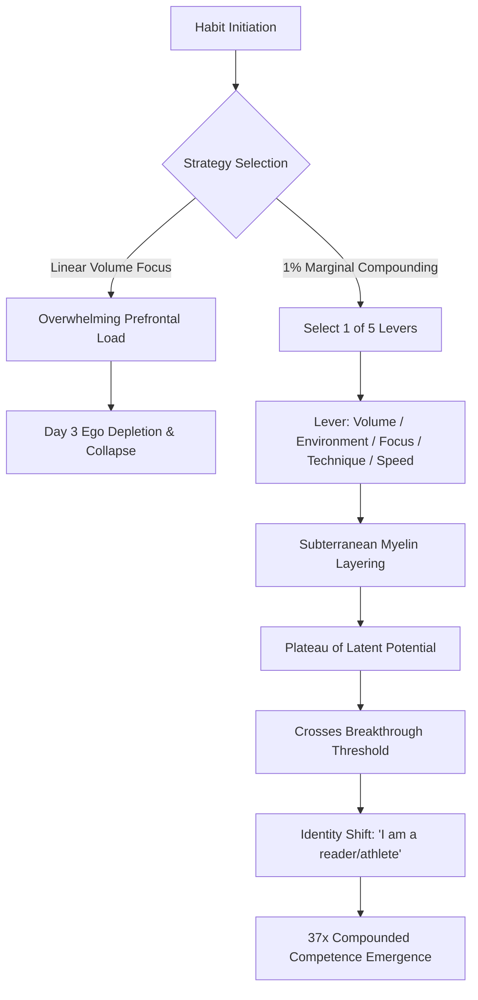

# NODE-P07: The Mathematics of Habit Compounding & Identity-Based Neuroplasticity

> **First-Principles Kernel**: Complex human competence is an emergent non-linear compound interest calculation: $(1 + 0.01)^{365} \approx 37.78$. Micro-improvements across orthogonal dimensions (environment, focus, technique, volume) bypass prefrontal executive fatigue and trigger identity-level neuroplastic reorganization.
> **Source**: ABrainoConscious — *The 1% Compounding Formula: Habit Engineering & Identity Shifts* (YouTube: `EZ2Bcihz700`)
> **Tree Coordinates**: `Roots > Cognitive Psychology & Metacognition > Vol. 05: Society, Money & Mind > Habit Engineering & Non-Linear Growth`

---

## 1. The Expert Perspective & Lived Experience

### Speaker's Core Thesis
Most ambitious individuals fail to sustain new habits because they attempt **linear brute-force volume expansion** (going from 0 to 2 hours in the gym or studying 4 hours daily). This triggers massive metabolic resistance in the basal ganglia and collapses within 3–4 days.

Sustainable elite competence is achieved by shifting focus from **Outcome Metrics (Results)** to **System Levers (Effort Components)** and applying the mathematical principle of **Marginal Compounding (1% daily improvement)** across multidimensional levers.

### The Compounding Money Thought Experiment
Choose between:
- **Option 1**: An immediate lump-sum cash payout of **₹1,00,000**.
- **Option 2**: A **₹1 coin** that doubles in value every single day for 30 days.

While intuitive human cognition selects Option 1, the geometric series for Option 2 yields:
$$S_{30} = 1 \times 2^{29} = ₹53,68,70,912 \quad (\approx ₹53.68 \text{ Crores})$$

```
Linear Effort Focus (Result Chasing)   ──► High Friction ──► 3-Day Burnout ──► Collapse to Zero
Geometric Compounding (System Levers)  ──► Low Friction  ──► Micro-Gains   ──► 37x Annual Transformation
```

---

## 2. First-Principles Deconstruction: The 5 Orthogonal Levers of the 1% Rule

The fatal error in applying the 1% rule is assuming that you must increase volume every single day (e.g. Day 1: 2 pages $\to$ Day 100: 102 pages). 

Instead, the **1% Micro-Improvement** is distributed across **Five Orthogonal Levers**:

```
                              THE 5 EFFORT LEVERS
                                       │
    ┌───────────────┬──────────────────┼──────────────────┬───────────────┐
    ▼               ▼                  ▼                  ▼               ▼
1. Volume      2. Environment      3. Focus Quality   4. Technique    5. Processing Speed
(Duration/Reps)(Friction Removal)  (Attention Control)(Methodology)   (Fluid Automaticity)
```

1. **Volume / Quantity**: Increasing duration or repetition by a microscopic fraction (e.g., adding 1 page or 2 minutes).
2. **Environment & Friction Engineering**: Removing visual cues that distract; placing tools in high-salience locations to reduce initiation activation energy.
3. **Quality of Focus & Interoception**: Noticing cognitive drift and practicing non-judgmental attention return.
4. **Technique & Mechanics**: Upgrading execution methodology (e.g., active recall instead of passive rereading; biomechanical form in lifting).
5. **Speed & Automaticity**: Performing the core routine with less cognitive deliberation and higher fluid efficiency.

---

## 3. The Non-Linear Lag: The Japanese Bamboo Parable & Latent Potential

Why do people quit right before exponential growth occurs?

### The Bamboo Tree Phenomenon
- When a Japanese/Chinese bamboo seed is planted, it shows **zero visible surface growth for 3 to 4 years**, despite continuous daily watering and fertilizing.
- During these silent years, it establishes an intricate underground root network spanning hundreds of square meters.
- In its fifth year, the bamboo shoots upward **80 to 90 feet in just 6 weeks**.

### The Plateau of Latent Potential
- In human neuroplasticity, initial habit repetitions build unseen myelin sheaths around neural circuits.
- Because surface results (visible muscle, fluent speech, exam scores) remain flat during early phases, the conscious ego suffers motivational burnout.
- **First-Principles Axiom**: *Habit formation is a delayed non-linear payoff curve.*

```
Performance
    ▲                                              / (Exponential Growth)
    │                                             /
    │                                            /
    │                             ──────────────┘ (Breakthrough Point)
    │                   . . . . . (Plateau of Latent Potential)
    │         . . . . .
    │. . . . . (Underground Root Building / Myelination)
    └─────────────────────────────────────────────────────────────► Time
```

---

## 4. Identity-Based Habits vs. Outcome Goals

| Dimension | Outcome-Based Goal (Fragile) | Identity-Based Goal (Anti-Fragile) |
| :--- | :--- | :--- |
| **Core Statement** | *"I need to go to the gym to lose 5 kg."* | *"I am an athlete who values physical vitality."* |
| **Locus of Motivation** | External target (exhausts willpower). | Internal self-concept (congruence drive). |
| **Behavioral Cascade** | Only controls gym attendance. | Automatically influences diet, sleep, posture, and self-respect. |
| **Failure Mode** | Quits after hitting goal or missing 2 days. | Self-corrects because default behavior violates self-identity. |

---

## 5. The Social Contagion Multiplier (The 57% Rule)

Human beings possess mirror neuron systems that unconsciously synchronize with reference group norms:
- **Nicholas Christakis & James Fowler (Framingham Heart Study)**: An individual's chance of becoming obese increased by **57%** if a close friend became obese.
- **The Peer Group Principle**: You are the median average of the 5 people with whom you interact most frequently.
- **The Digital Proxy Rule**: If you lack high-performance physical peers, your active information diet (books, podcasts, audio lectures) serves as your primary cognitive reference group.

---

## 6. Mathematical Model

### 1. The Compounding Equation of Daily Habits

$$\text{Annual Growth} = (1 + r)^{365}$$

- When $r = +0.01$ (1% daily improvement):
  $$(1 + 0.01)^{365} = (1.01)^{365} \approx 37.78 \quad (3,778\% \text{ improvement})$$

- When $r = -0.01$ (1% daily decay / neglect):
  $$(1 - 0.01)^{365} = (0.99)^{365} \approx 0.0255 \quad (\text{collapse to } 2.5\% \text{ of baseline})$$

```
Ratio of 1% Gain vs 1% Loss over 1 Year:
37.78 / 0.0255 ≈ 1,481x Performance Divergence
```

---

## 7. Visual Concept Map



---

## 8. Actionable Heuristics & Habit Protocols

1. **The Single-Lever Rotation Rule**:
   - When building a habit, pick only **one lever** to upgrade each day (e.g. Day 1: read 2 pages $\to$ Day 2: clean desk $\to$ Day 3: eliminate phone notifications $\to$ Day 4: apply active recall).
2. **The "Never Miss Twice" Heuristic**:
   - Missing one day is an accident; missing two consecutive days is the start of a new, negative compounding habit ($0.99^n$).
3. **The 7-Day Contact Audit**:
   - Inspect your recent phone calls and messaging history over the last 7 days. If your primary circle normalizes low-agency distraction, actively replace input hours with curated books and lectures.

---

## 9. Self-Test & Causal Reconstruction Questions

1. *Why does $(1 + 0.01)^{365}$ yield a 37x improvement while $(1 - 0.01)^{365}$ drops to near zero? Explain the asymmetry of geometric compounding.*
2. *What are the Five Orthogonal Levers of the 1% rule, and why does rotating between them prevent prefrontal burnout?*
3. *How does the Japanese Bamboo parable explain the 'Plateau of Latent Potential' in neural skill acquisition?*
4. *Why does shifting from 'I want to read books' to 'I am a reader' cascade into multiple positive behaviors simultaneously?*

---

## 10. Knowledge Tree Linkages & Cross-Domain Bridges

- **Roots To**:
  - [[the-psychology-of-self-trust-and-willpower-reconstruction]]: Rebuilding internal credit through micro-commitments.
  - [[the-neurobiology-of-action-and-deep-focus]]: Basal Ganglia proceduralization and dopamine reward prediction errors.
- **Branches Into**:
  - [[needs-and-incentives]]: Designing positive personal payoff structures.
  - [[feedback-loops]]: Reinforcing positive feedback dynamics in learning.
- **Lateral Bridge**:
  - **British Cycling Team Marginal Gains (Dave Brailsford)**: In 2003, British Cycling had won only a single gold medal in 76 years. By breaking down every aspect of cycling (ergonomic seat design, tire alcohol rubs, optimal pillow selection for sleep, handwashing technique to prevent infections) and improving each by 1%, they dominated the Tour de France and Olympic Games for a decade.
