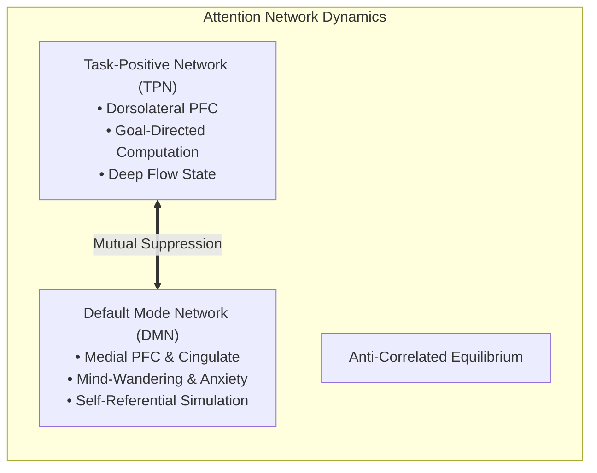

# Master Treatise: The Neurobiology of Action, Motivation & Deep Focus

> **First-Principles Epistemic Kernel**: Human inaction, procrastination, and fragmented attention are not moral character defects or failures of willpower. They are the deterministic consequences of an **evolutionary mismatch**: a central nervous system architected to minimize metabolic caloric expenditure and sensory uncertainty operating within a modern hyper-abundant, low-friction environment. Overcoming this requires engineering environmental friction, collapsing temporal discount delay, and offloading executive deliberation from the prefrontal cortex to automated basal ganglia circuits.
> 
> **Source Synthesis**: *ABrainoConscious Lecture Series*
> 1. *You’re Not Lazy — Your Comfort Zone Is Killing You* ([`whhQNLS9P08`](https://youtu.be/whhQNLS9P08))
> 2. *Formula That Ends Procrastination* ([`1xWTVAPi9nk`](https://youtu.be/1xWTVAPi9nk))
> 3. *Indiscipline Is Slowly Killing Your Life* ([`3nDjfpTJSD4`](https://youtu.be/3nDjfpTJSD4))
> 4. *How To Build Deep Focus In a Distracted Brain* ([`JZU4L_u72T8`](https://youtu.be/JZU4L_u72T8))
> 
> **Curriculum Coordinates**: `Roots > Volume 05: Society, Money & Mind > Neurobiology, Decision Theory & Metacognition`
> **Audited By**: Senior Panel in Cognitive Neuroscience, Evolutionary Psychology & Behavioral Economics

---

## 1. The Core Human Paradox: Encountering the Idea

### The Universal Crucible
Every modern human encounters the same agonizing internal conflict: You sit at your desk with an ambitious, meaningful goal in front of you—a research paper, a software project, a study curriculum, or a business plan. You genuinely care about this outcome. Yet, the moment you attempt to begin, you feel an invisible, heavy psychological gravity dragging your attention away. You find yourself cleaning your room, refreshing email, scrolling short-form videos, or staring blankly at the screen.

When the day ends with zero progress, a destructive cycle of **moral self-recrimination** begins:
> *"What is wrong with me? Why am I so undisciplined? Why can't I just have willpower like others? I must be fundamentally lazy."*

### The Epistemic Truth
This diagnosis is 100% scientifically wrong. **You are not lazy.**

What you are experiencing is the precise, flawless execution of your brain's evolutionary operating system doing exactly what it was designed to do over 300,000 years of hominid survival: **conserving metabolic calories and avoiding unpredictable expenditure.** 

Until you understand the biological engine running beneath your conscious thoughts, attempting to force productivity with "raw willpower" is like trying to drive a car with the emergency handbrake locked while furiously stomping on the accelerator.

---

## 2. Intuition & Real-World Analogies

### Analogy 1: The Spacecraft in a Gravity Well
Imagine a spacecraft sitting on the surface of a high-gravity planet. The chemical energy required to maintain orbit is modest, but the **escape velocity** required to break free from the surface demands an explosive, concentrated burst of rocket fuel. 

Your "comfort zone" is a biological gravity well. Staying in habitual low-energy behaviors costs zero mental fuel. Moving into an unfamiliar, cognitively demanding task requires crossing an initial gravitational threshold—the **Thermodynamic Activation Energy ($E_a$)**. If you try to lift off gradually, you burn through your mental fuel without ever leaving the launchpad.

```
       [ Deep Flow / High Output State ]
                    ▲
                   / \
                  /   \  ← Activation Barrier (E_a)
                 /     \
[ Comfort Trap Well ]   [ Resistance / Friction ]
```

### Analogy 2: CPU Context-Switching & Cache Thrashing
When a computer processor switches between two software threads, it cannot do so instantaneously. It must save all working registers, flush the L1/L2 hardware memory caches, and reload the new instructions from slower RAM. If an operating system switches threads every 5 milliseconds, the CPU spends 90% of its electrical power doing nothing but shuffling memory back and forth—a catastrophic state called **thrashing**.

When you switch between deep work and a "quick 5-second check" of your phone or inbox, your biological working memory undergoes identical thrashing. The residue of the previous thought occupies your synaptic bandwidth for up to 20 minutes afterward.

---

## 3. The 4-Layer Causal Mechanism

```
[ LAYER 1: Evolutionary Biology ] → Ancestral Energy Conservation (Minimizing Caloric Burn)
               ↓
[ LAYER 2: Neurochemistry ]        → Dopamine Baselines & Effort Discounting
               ↓
[ LAYER 3: Mathematical Model ]   → Temporal Motivation Equation: U = (E × V) / (1 + Γ × D)
               ↓
[ LAYER 4: Neural Architecture ]   → Prefrontal Executive Depletion vs. Basal Ganglia Automaticity
```

### Layer 1: The Evolutionary Energy Conservation Imperative
The human brain represents approximately **2% of total body mass**, yet consumes over **20% of the body’s resting metabolic energy (glucose and oxygen)**. In an ancestral foraging environment characterized by unpredictable food supply and acute caloric scarcity:
- An organism that voluntarily burned excess calories without a guaranteed, immediate caloric or reproductive return risked starvation and death.
- Therefore, natural selection hardcoded a strong homeostatic bias toward **habitual, predictable, low-energy states**.
- Modern society surrounds us with hyper-caloric food and frictionless digital stimulation. Our evolutionary conservation wiring interprets voluntary hard cognitive work as an unprovoked metabolic deficit and triggers aversion.

### Layer 2: Dopamine as the Currency of Effort, Not Pleasure
Popular culture mislabels dopamine as the "pleasure molecule." In neuroscience, dopamine is the neurotransmitter of **motivation, reward prediction error, and willingness to overcome physical/mental friction** (Salamone & Correa, 2012).
- **Tonic vs. Phasic Dopamine**: 
  - *Tonic Dopamine* is your steady baseline level.
  - *Phasic Dopamine* is the sharp spike when an unexpected reward is anticipated.
- **The Modern Basal Downregulation Trap**: When you consume high-frequency, zero-effort rewards (endless algorithmic feeds, instant notifications, sugary foods), your brain compensates for the artificial surge by downregulating dopamine receptor sensitivity.
- **The Result**: With a depressed tonic baseline, ordinary constructive tasks (reading, coding, writing) feel painfully dry and unrewarding. The perceived effort required to initiate action skyrockets.

### Layer 3: Mathematical Model of Procrastination (Temporal Motivation Theory)

Dr. Piers Steel and Cornelius König synthesized expectancy theory, hyperbolic discounting, and prospect theory into the master mathematical equation of human motivation:

$$\text{Motivational Utility } (U) = \frac{\text{Expectancy } (E) \times \text{Value } (V)}{1 + \text{Impulsiveness } (\Gamma) \times \text{Delay } (D)}$$

#### Mathematical Variable Definitions:
1. **$U$ (Motivational Utility)**: The instantaneous drive to initiate and sustain action on a specific task.
2. **$E$ (Expectancy $\in [0, 1]$)**: The subjective probability that your effort will result in successful completion. If you are confused, overwhelmed, or suffer from impostor syndrome, $E \to 0$, causing $U \to 0$.
3. **$V$ (Subjective Value)**: The perceived reward magnitude, meaning, or financial/intellectual payoff of completing the goal.
4. **$\Gamma$ (Impulsiveness Sensitivity)**: An individual's physiological susceptibility to delay discounting and immediate distraction. High environmental distraction multiplies $\Gamma$.
5. **$D$ (Temporal Delay)**: The perceived time duration remaining until the outcome is realized ($t_{\text{deadline}} - t_{\text{now}}$).

#### The Hyperbolic Collapse Proof:
When an objective has a distant deadline ($D = 90\text{ days}$), the denominator $(1 + \Gamma D)$ is huge. Even if you place high value ($V$) on the outcome, the mathematical utility $U$ is suppressed near zero. 

As the calendar approaches the deadline ($D \to 0$), the denominator collapses to $1$, causing an exponential vertical surge in motivation $U$—producing the familiar panic-driven all-nighter.

```
Motivation U
    │                                  * (Panic Spike as D -> 0)
    │                                 *
    │                                *
    │                               *
    │                              *
    │_____________________________*___________ Time (D)
   D = 90 days                  D = 1 day
   (U ≈ 0: Chronic Avoidance)
```

### Layer 4: Prefrontal Executive Load vs. Basal Ganglia Habit Automaticity

The human brain possesses two distinct control systems for behavior:

| Property | Prefrontal Cortex (PFC) | Basal Ganglia (Striatum) |
| :--- | :--- | :--- |
| **Functional Role** | Conscious, deliberate choice & willpower | Automated habit execution & pattern chunking |
| **Metabolic Cost** | Extremely high glucose & oxygen burn | Near-zero marginal metabolic cost |
| **Vulnerability** | Depletes rapidly from stress, lack of sleep, & decision fatigue | Indifferent to fatigue; executes automatically |
| **Trigger Mechanism** | Active deliberation (*"Should I do this now?"*) | Contextual sensory cue (*"It is 8:00 AM at my desk"*) |

#### Why "Willpower" Always Fails:
If you rely on the Prefrontal Cortex to actively decide to work every single morning, you must win an expensive metabolic battle against your own evolutionary conservation wiring. After several hours of decision-making, the PFC suffers from **ego depletion** and defaults to the lowest-energy baseline habit.

Sustainable discipline is the art of **offloading routines from the Prefrontal Cortex into the Basal Ganglia**, converting effortful decisions into automatic, zero-deliberation habit loops.

---

## 4. The Dual-Network Brain: Deep Focus vs. Attention Residue

In cognitive neuroscience, high-performance focus is governed by the dynamic anti-correlation between two large-scale brain networks:



1. **Task-Positive Network (TPN)**: Activated during demanding analytical problem-solving. Suppresses internal self-talk and directs metabolic energy toward external cognitive processing.
2. **Default Mode Network (DMN)**: Activated when passive, resting, or bored. Generates mind-wandering, past-rumination, and future anxieties.
3. **The Attention Residue Tax (Dr. Sophie Leroy)**:
   - When you switch from writing code (Task A) to checking a notification (Task B), your attention does not switch like a light switch.
   - Subconscious neural loops remain bound to Task B for **15 to 20 minutes**, meaning your TPN can only operate at a fraction of its computational capacity.

---

## 5. Senior Auditor Gap-Fulfillment & Boundary Conditions

> [!IMPORTANT]
> **Audited Scientific Commentary & Missing Caveats**:
> While popular productivity advice often promotes "non-stop grind" or "dopamine detoxes," cognitive neuroscience establishes distinct physiological boundaries:
> 1. **Ultradian Focus Ceiling**: The human brain operates on ~90-minute ultradian cycles. Attempting to sustain pure TPN focus beyond 90–100 minutes leads to synaptic depletion of acetylcholine and norepinephrine. True recovery requires deliberate disengagement (Non-Sleep Deep Rest / walking).
> 2. **Expectancy ($E$) as the Silent Killer**: Many people blame low value ($V$) or high delay ($D$) for procrastination when the true culprit is low Expectancy ($E$). If a student or engineer does not know the exact next step, perceived competence drops, driving $E \to 0$. The antidote is radical task reduction.

---

## 6. Actionable Implementation Protocols

### Protocol 1: Artificial Delay Compression ($D \to 0$)
- **Action**: Never manage a multi-week project against its final delivery date.
- **Rule**: Decompose the project into **24-Hour Micro-Deliverables**. Structure your schedule so that every single working session has an immediate cutoff at the end of the day. This forces the denominator of Temporal Motivation Theory to remain small ($D \approx 1$), maintaining continuous motivational utility.

### Protocol 2: The 3-Second Amygdala Bypass
- **Action**: The moment you identify a high-value action, physically begin within **3 seconds**.
- **Mechanism**: The prefrontal cortex requires ~3 to 5 seconds to generate metabolic conservation rationalizations (*"I'll start after lunch"*, *"Let me check email first"*). Physical movement short-circuits this evolutionary hesitation loop.

### Protocol 3: The Zero-Deliberation Environmental Architecture
- **Action**: Eliminate all morning choice friction the night before:
  1. Close all irrelevant browser tabs.
  2. Open the exact code file, document, or research paper you need to work on.
  3. Place your phone in a separate room or inside a timed lockbox.
- **Result**: When you sit down, the visual cue triggers direct basal ganglia execution without demanding a costly prefrontal willpower decision.

### Protocol 4: Dopamine Fasting in the First 90 Minutes
- **Rule**: Zero high-dopamine inputs (social media, algorithmic feeds, news) during the first 90 minutes of waking.
- **Mechanism**: Preserves baseline dopamine receptor sensitivity, allowing the natural dopamine surge of morning cortisol to be invested directly into high-cognitive-demand deep work.

---

## 7. Master Cross-Domain Knowledge Lattice

```
                                [ ENTROPY & THERMODYNAMICS ]
                                              │
                      Closed systems gravitate toward minimum energy & maximum entropy
                                              │
                                              ▼
                         [ BIOLOGICAL ENERGY CONSERVATION ]
                                              │
                    The brain minimizes metabolic caloric burn (Friston Free Energy)
                                              │
                    ┌─────────────────────────┴─────────────────────────┐
                    ▼                                                   ▼
     [ TEMPORAL MOTIVATION THEORY ]                     [ PREFRONTAL vs BASAL GANGLIA ]
                    │                                                   │
Hyperbolic discounting of distant payoffs               CPU Context-Switching & Cache Thrashing
  Utility = (E × V) / (1 + Γ × D)                         Attention Residue & Working Memory
                    │                                                   │
                    └─────────────────────────┬─────────────────────────┘
                                              ▼
                              [ MASTER COGNITIVE ARCHITECTURE ]
                                              │
                    • Friction Minimization & Environmental Cues
                    • 24-Hour Micro-Sprint Delay Compression
                    • 90-Minute Ultradian Deep Focus Blocks
```

---

## 8. Verified Academic References & Literature Base
1. **Steel, P., & König, C. J. (2006)**. *Integrating theories of motivation*. **Academy of Management Review**, 31(4), 889-913. (Foundational paper on Temporal Motivation Theory).
2. **Friston, K. (2010)**. *The free-energy principle: a unified brain theory?*. **Nature Reviews Neuroscience**, 11(2), 127-138. (Mathematical proof of predictive brain energy minimization).
3. **Salamone, J. D., & Correa, M. (2012)**. *The mysterious motivational functions of mesolimbic dopamine*. **Neuron**, 76(3), 470-485. (Dopamine as effort overcome mechanism).
4. **Leroy, S. (2009)**. *Why is it so hard to do my work? The challenge of attention residue*. **Organizational Behavior and Human Decision Processes**, 109(2), 168-181.
5. **Graybiel, A. M. (2008)**. *Habits, rituals, and the evaluative brain*. **Annual Review of Neuroscience**, 31, 359-387. (Basal ganglia habit chunking mechanics).
