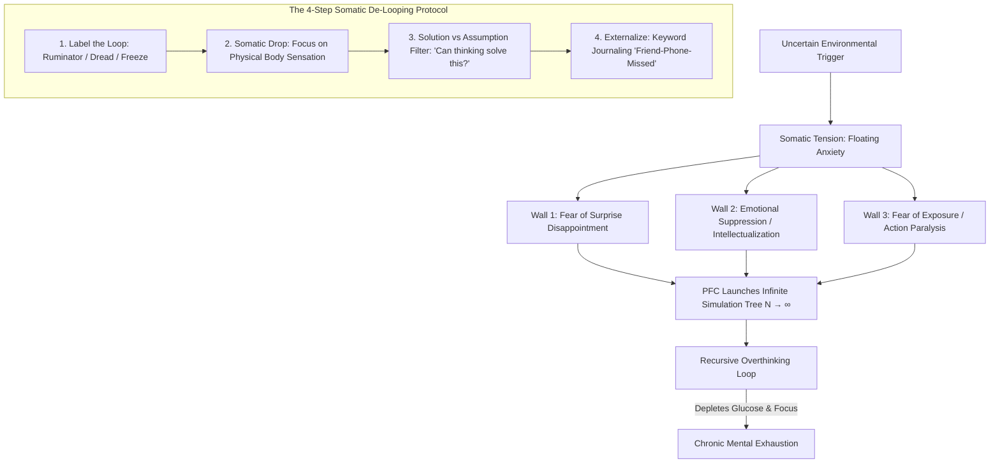

# NODE-P06: The Neurobiology of Overthinking & Floating Anxiety

> **First-Principles Kernel**: Overthinking is not a conscious analytical superpower; it is an evolutionary defense mechanism where the brain attempts to convert irreducible environmental uncertainty into simulated certainty. When unanchored physiological distress (floating anxiety) arises, the brain manufactures infinite cognitive branch loops to avoid somatic feeling and the threat of real-world failure.
> **Source**: ABrainoConscious — *Overthinking Is Not What You Think: Floating Anxiety & Cognitive Loops* (YouTube: `hO6qvNEp_iY`)
> **Tree Coordinates**: `Roots > Cognitive Psychology & Metacognition > Vol. 05: Society, Money & Mind > Cognitive Loops & Somatic Regulation`

---

## 1. The Expert Perspective & Lived Experience

### Speaker's Core Thesis
Most people believe overthinking is a sign of high intelligence or thorough preparation. In reality, **overthinking is a psychological fortress constructed of three defensive walls**. 

The brain has an ancestral bias that equates **uncertainty with life-threatening physical danger**. Because thinking creates the illusion of control, the brain spins recursive hypothetical simulations ($N \to \infty$) to escape the vulnerability of raw somatic feeling and the risk of real-world failure.

### The 3 Typologies of Overthinking Loops

```
                                  OVERTHINKING TYPOLOGIES
                                             │
         ┌───────────────────────────────────┼───────────────────────────────────┐
         ▼                                   ▼                                   ▼
  1. The Ruminator                   2. Future Dread                     3. Present Freeze
   (Past Counterfactuals)             (Catastrophic Projection)           (Analysis Paralysis)
  "I should have said X..."          "What if the worst happens..."      "I need more data before I act..."
  Replaying & editing past events.   Disguising worry as preparation.    Endless planning; zero execution.
```

1. **The Ruminator (Past-Focused)**: Replaying historical events, missed retorts, and social regrets. The brain burns massive metabolic glucose simulating alternative past branches that cannot physically be changed.
2. **The Future Dread (Future-Focused)**: Projecting catastrophic worst-case scenarios. Disguised as "risk preparation," but actually activates chronic sympathetic nervous system distress for events with $<1\%$ probability.
3. **The Present Freeze (Present-Focused)**: Compulsive information hoarding and endless planning under the cognitive alibi *"I am not fully ready yet."*

---

## 2. First-Principles Deconstruction: The Three Walls of the Fortress

Why does the human brain compulsively construct overthinking loops? The architecture rests upon **Three Protective Walls**:

```
                       THE PSYCHOLOGICAL FORTRESS
  ┌──────────────────────────────────────────────────────────────────┐
  │ WALL 1: Fear of Surprise Disappointment                          │
  │   → Past unexpected trauma taught the brain: "Never get caught   │
  │     unprepared again; pre-simulate every conceivable outcome."   │
  ├──────────────────────────────────────────────────────────────────┤
  │ WALL 2: Emotional Suppression & The Intellectualization Defense  │
  │   → Environment punished raw feeling ("Don't cry, be tough").    │
  │   → Brain learns feeling is dangerous; immediately jumps to      │
  │     abstract "Emotional Thinking" instead of somatic processing. │
  ├──────────────────────────────────────────────────────────────────┤
  │ WALL 3: The Safe Fantasy of Planning vs. The Danger of Action    │
  │   → In fantasy planning, the ego stays perfect and unharmed.     │
  │   → Physical action risks public judgment, mockery, and failure. │
  │   → Brain keeps you trapped in data gathering to avoid reality.  │
  └──────────────────────────────────────────────────────────────────┘
```

---

## 3. The Central Mechanism: "Floating Anxiety" & Narrative Attachment

One of the most profound cognitive illusions is the belief that **thoughts cause anxiety**. In clinical neurobiology, the causal arrow is frequently reversed:

1. **Somatic Genesis (Floating Anxiety)**: Due to chronic stress, unresolved conditioning, fatigue, or autonomic dysregulation, the body generates unanchored physiological arousal (tightness in chest, knot in stomach, shallow respiration).
2. **The Brain's Narrative Search**: The prefrontal cortex cannot tolerate unanchored physical tension. It frantically scans the environment and memory for a **"narrative hook"** (*"Why am I feeling this? It must be because my friend didn't reply to my text, or because of my job security"*).
3. **The Cognitive Loop**: The pre-existing somatic anxiety glues itself to a random passing thought, creating an obsessive loop of overthinking that perpetuates the physical tension.

```
Unanchored Somatic Arousal ──► PFC Scans for Narrative Hook ──► Thought Attached ("He didn't call")
(Floating Anxiety)                                                     │
        ▲                                                              ▼
        └────────────────── Recursive Cognitive Loop ─────────────────┘
```

---

## 4. Senior Auditor Annotations & Scientific Literature

> [!NOTE]
> **Auditor Commentary**: The principles synthesized in this lecture map directly onto established clinical neuroscience frameworks:

1. **The Somatic Marker Hypothesis (Antonio Damasio, 1996)**:
   - Emotions are fundamentally bodily states (visceral and autonomic alterations). When cognitive intellectualization is used to bypass somatic markers, decision-making degrades into recursive loop paralysis.
2. **Intolerance of Uncertainty (Dugas, Gagnon, & Ladouceur, 1998)**:
   - Chronic worry is driven not by the probability of an adverse event, but by an individual's inability to tolerate the emotional ambiguity of not knowing the future.
3. **Intellectualization as a Defense Mechanism (Anna Freud / George Vaillant)**:
   - Intellectualization is a Level 3 neurotic defense mechanism that blocks instinctual and visceral distress by framing situations in purely abstract, theoretical terms.
4. **Default Mode Network (DMN) Hyperactivity (Raichle et al., 2001)**:
   - Overthinking correlates with hyper-connectivity within the medial prefrontal cortex and posterior cingulate cortex (DMN), suppressing the Task-Positive Network (TPN).

---

## 5. Visual Concept Map



---

## 6. Actionable Heuristics & The De-Looping Protocol

### Step 1: Cognitive Pattern Categorization
The instant recursive thinking starts, mentally label the loop:
- *"I am running the Ruminator loop (past regret)."*
- *"I am running Future Dread (catastrophizing)."*
- *"I am running Present Freeze (information hoarding)."*

### Step 2: The "Somatic Drop" (Interoception Shift)
Stop analyzing the content of the thought. Redirect 100% of conscious attention down into the physical body:
- *Where is the sensation located?* (Throat constriction, stomach knot, chest tightness).
- Observe the raw physical pressure for 90 seconds without labeling it as "bad" or "dangerous." When the somatic tension is felt and acknowledged, the narrative loop loses its fuel.

### Step 3: The Action vs. Assumption Filter
Ask the decisive diagnostic question:
$$\text{Can additional thinking provide a certain answer to this question?}$$
- If **NO** (e.g., guessing why someone didn't reply): Stop simulating. Only direct communication or physical testing can provide data.
- If **YES**: Draft 1 concrete next step and schedule execution.

### Step 4: Keyword Externalization (Draining the Container)
When the working memory container is overflowing, write down only raw **keywords** instead of full sentences:
- Example: `Friend` $\to$ `Missed Call` $\to$ `Uncertainty` $\to$ `Will call at 6 PM`.
- Capturing the keywords on paper signals to the brain that the data is secured, breaking the default mode loop.

---

## 7. Self-Test & Causal Reconstruction Questions

1. *Why does the human brain attempt to resolve uncertainty through thinking, and why is this mathematically impossible?*
2. *Explain the concept of 'Floating Anxiety.' How does a physical bodily sensation attach itself to an unrelated future thought?*
3. *What are the Three Walls of the Overthinking Fortress, and how does Wall 2 (suppression of feeling) convert simple emotions into chronic mental loops?*
4. *Why does keyword journaling break working memory overthinking loops more effectively than keeping thoughts in your head?*

---

## 8. Knowledge Tree Linkages & Cross-Domain Bridges

- **Roots To**:
  - [[the-psychology-of-self-trust-and-willpower-reconstruction]]: How broken internal contracts generate chronic baseline anxiety.
  - [[the-neurobiology-of-action-and-deep-focus]]: Default Mode Network (DMN) vs. Task-Positive Network (TPN).
- **Branches Into**:
  - [[feedback-loops]]: Positive feedback runaway loops in cognitive systems.
  - [[temporal-motivation-theory]]: How anxiety-driven Present Freeze manifests as chronic procrastination.
- **Lateral Bridge**:
  - **Deadlock in Distributed Computing (Computer Science)**: In computer science, a *Deadlock* occurs when multiple processes are stuck waiting for resources held by each other, preventing any progress. Similarly, the Overthinking Loop creates a cognitive deadlock where the brain refuses to act without 100% certainty, but certainty can only be obtained by acting in the real world.
