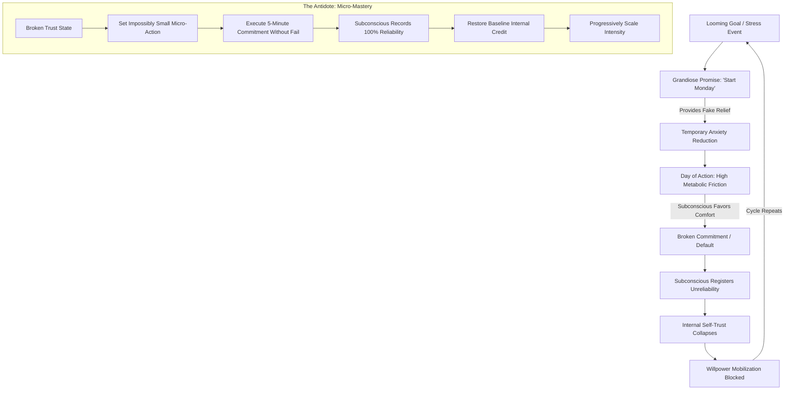

# NODE-P05: The Psychology of Self-Trust & Willpower Reconstruction

> **First-Principles Kernel**: Willpower failure is not a moral defect or intrinsic laziness; it is the breakdown of internal predictive credibility (self-trust). When the conscious mind makes grand commitments solely to alleviate acute stress and repeatedly defaults, the subconscious mind ceases to allocate metabolic effort to conscious intentions.
> **Source**: ABrainoConscious — *Day 1 Again: Always Day 1* (YouTube: `H367RPxjBBk`)
> **Tree Coordinates**: `Roots > Cognitive Psychology & Metacognition > Vol. 05: Society, Money & Mind > Self-Trust & Behavioral Execution`

---

## 1. The Expert Perspective & Lived Experience

### Speaker's Core Thesis
Most individuals trapped in perpetual cycles of restarting ("Always stuck at Day 1") diagnose their failure as a lack of willpower, discipline, or motivation. This diagnosis is fundamentally flawed. 

You do not have a willpower deficit; you have an **internal credit default (a self-trust collapse)**. The subconscious mind acts as an internal observer that registers every broken contract. When you repeatedly promise action and fail to deliver, your mind stops believing your own commands and refuses to mobilize energetic resources.

### The "Unreliable Friend (Rahul)" Parable
Imagine you need to catch a critical 5:00 AM flight or train to Delhi and ask your friend Rahul for a ride:
1. **First Incident**: Rahul enthusiastically promises to pick you up at 5:00 AM. When the morning arrives, his phone is switched off. You miss your departure. You feel anger and your trust declines.
2. **Second Incident**: Weeks later, you need another ride. Rahul insists, *"Bro, this time I 100% promise I'll be there."* At 5:00 AM, his phone is off again. You miss your flight a second time.
3. **The Diagnostic Question**: Would you ever trust Rahul with a critical life responsibility a third or fourth time? **Never.**

**The Isomorphism**: *Rahul is your comfort-seeking subconscious mind, and you are the friend who keeps making unverified promises.* Every time you make a grandiose plan (*"From tomorrow I will wake up at 5:00 AM and study 2 hours daily"*) solely to soothe immediate anxiety, and then fail to follow through, you treat yourself as an unreliable partner.

```
Conscious Ego (Stress/Anxiety) ──[Makes Grand Promise]──► Immediate Ego Relief
                                                              │
                                                              ▼
Morning Execution (Basal Ganglia/Homeostasis) ───────► Default & Inaction
                                                              │
                                                              ▼
Subconscious Credit Ledger ──────────────────────────► Self-Trust Eroded (-Δ Credibility)
                                                              │
                                                              ▼
Next Cycle ──────────────────────────────────────────► Zero Willpower Mobilized ("Day 1 Again")
```

---

## 2. First-Principles Deconstruction & Mechanics

### 1. The Psychological Mechanism of "Anxiety-Relief Planning"
Why do people make unrealistic, grandiose promises in the first place?
- When confronted with looming deadlines, exams, or life dissatisfaction, the brain experiences acute cortisol and cognitive distress.
- Making an extreme plan (*"I will completely reinvent my life starting Monday"*) triggers an immediate release of anticipatory dopamine and soothes the ego's anxiety without doing any actual physical work.
- The plan functions as an emotional sedative rather than an executable operational strategy.

### 2. The Predictive Brain & Internal Credit Allocation
The brain operates as a hierarchical Bayesian predictive machine (Friston, Clark):
- The Prefrontal Cortex (PFC) generates conscious intentions.
- Subcortical structures (Basal Ganglia, Ventral Striatum) allocate physical energy and autonomic arousal based on the **historical probability of execution**.
- When the conscious mind establishes a track record of default, the subcortical gating mechanism classifies future conscious commands as "cheap talk" (low-probability signals) and suppresses dopamine release, creating the subjective feeling of total willpower paralysis.

### 3. The 4-Stage Breakdown Cycle:
```
1. Acute Stress / Ego Dissatisfaction
                ↓
2. Grandiose Commitment (Ego Relief Sedative)
                ↓
3. Execution Friction & Subconscious Default
                ↓
4. Self-Trust Bankruptcy & Willpower Depletion ("Day 1 Again")
```

---

## 3. Senior Auditor Annotations & Scientific Literature

> [!NOTE]
> **Auditor Commentary**: The "Rahul" parable reflects core empirical findings across behavioral economics and cognitive neuropsychology:

1. **Self-Efficacy Theory (Albert Bandura, 1977)**:
   - Self-efficacy is an individual's belief in their capacity to execute behaviors necessary to produce specific performance attainments.
   - Bandura demonstrated that *Mastery Experiences* (actual successful execution) are the single most potent builder of self-efficacy, while *Repeated Failure to Execute* permanently impairs cognitive mobilization.
2. **Temporal Discounting & Hyperbolic Preferences (Ainslie, 2001)**:
   - The conscious self making the plan at night operates under cold, rational cognition (PFC).
   - The self waking up at 5:00 AM operates under hot, visceral state preferences (amygdala / homeostatic caloric preservation).
   - Without an established bridge of micro-commitments, the hot state always dominates the cold plan.
3. **Ego Depletion vs. Allocation Model (Inzlicht & Schmeichel, 2012)**:
   - Willpower failure is not the running out of a biological glucose tank, but a shift in task valuation and executive allocation driven by perceived reward probability.

---

## 4. Visual Concept Map



---

## 5. Actionable Heuristics & The Reconstruction Protocol

### Heuristic 1: The "Un-Losable Contract" Rule
If your internal self-trust is in default, **never set standard-sized goals**. Set goals so small that failure is impossible:
- Instead of: *"I will study 4 hours daily starting tomorrow."*
- Apply: *"I will open the textbook and read exactly 1 paragraph at 7:00 AM."*
- Instead of: *"I will go to the gym for 90 minutes 6 days a week."*
- Apply: *"I will put on my running shoes and walk out the front door for exactly 5 minutes."*

### Heuristic 2: Decouple Planning from Anxiety Relief
Never make a behavioral commitment while feeling panicky, guilty, or emotionally distressed. Emotional commitments are almost always oversized fantasies intended to quiet the ego rather than real operational strategies.

### Heuristic 3: Protect Internal Integrity Above All
Treat a promise made to yourself with the same sacred contractual weight as a public business contract with a severe financial penalty. If you cannot guarantee execution, do not issue the internal promise.

---

## 6. Self-Test & Causal Reconstruction Questions

1. *Why does making an extreme self-improvement plan late at night temporarily reduce stress, and why does this lead to failure the following morning?*
2. *In terms of the 'Rahul' parable, why does willpower disappear after 3-4 failed attempts at starting a new habit?*
3. *What is the neurological and behavioral mechanism behind starting with a 5-minute micro-habit rather than an ambitious 2-hour daily routine?*
4. *How does the concept of self-trust link with Albert Bandura's Self-Efficacy Theory?*

---

## 7. Knowledge Tree Linkages & Cross-Domain Bridges

- **Roots To**:
  - [[the-neurobiology-of-action-and-deep-focus]]: Metabolic Energy Conservation & Prefrontal Gating.
  - [[needs-and-incentives]]: The Economic Alignment of Personal Utility & Commitment Devices.
- **Branches Into**:
  - [[habit-automaticity]]: Basal Ganglia chunking and procedural habit formation.
  - [[temporal-motivation-theory]]: Overcoming hyperbolic time discounting.
- **Lateral Bridge**:
  - **Sovereign Debt & Credit Ratings (Economics)**: When a sovereign nation repeatedly defaults on its treasury bonds, capital markets assign it a "junk" credit rating and demand exorbitant interest rates or refuse to lend entirely. Similarly, when your conscious ego repeatedly defaults on internal behavioral contracts, your subconscious mind assigns your conscious intentions a junk rating and refuses to lend metabolic energy.
