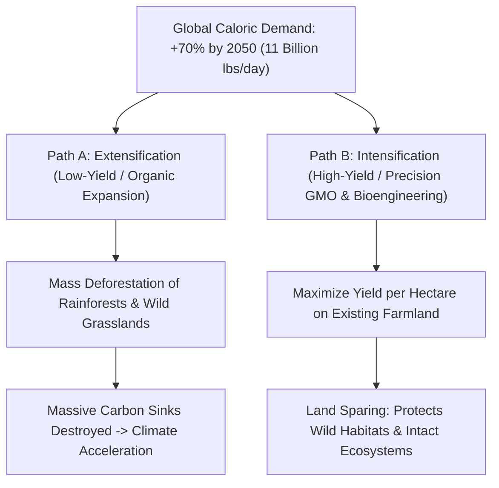

# Agricultural Energetics & The Land-Sparing Invariant

> **Axiomatic Kernel (Ecological Thermodynamics)**: To feed expanding human populations without driving global biosphere collapse, humanity must maximize caloric and nutrient yield per unit area ($E_{\text{out}} / \text{Area}$). Agricultural **Intensification (Land Sparing)** preserves wild primary biomes and carbon sinks, whereas low-yield **Extensification (Land Sharing)** consumes wilderness for agricultural clearance.

---

## 1. The Energetic Fork: Intensification vs. Extensification

### The Thermodynamic & Nitrogen Invariants
1. **Photosynthetic Conversion Efficiency ($\eta$)**: Terrestrial crops capture only $\approx 1-2\%$ of incident solar energy. Enhancing RuBisCO kinetics and pest resilience directly elevates photosynthetic harvest index without expanding acreage.
2. **The Nitrogen Bottleneck**: Synthetic nitrogen fertilizers (Haber-Bosch process) consume $\approx 1-2\%$ of total global energy production and cause eutrophic water pollution. Engineering non-leguminous staple crops with autonomous **biological nitrogen fixation** resolves both carbon emissions and groundwater runoff.

---

## 2. Senior Auditor Annotations & 30-Year Safety Consensus

> [!NOTE]
> **Empirical Epistemic Consensus**: Over three decades of multi-agency evaluations (WHO, European Commission, US National Academy of Sciences, American Association for the Advancement of Science) encompassing thousands of peer-reviewed studies have established that **commercial bioengineered (GMO) crops pose no greater risk to human consumption or digestive health than conventionally bred varieties**.

---

## 3. Tree Linkages
- **Trunk**: [[selective-toxicity-and-appeal-to-nature-fallacy]], [[demographic-momentum-and-fertility-transition]]
- **Branches**: [[crop-bioengineering-bt-endotoxins-and-biofortification]]
- **Leaves**: [[kurzgesagt-gmo-food-genetic-engineering]]
