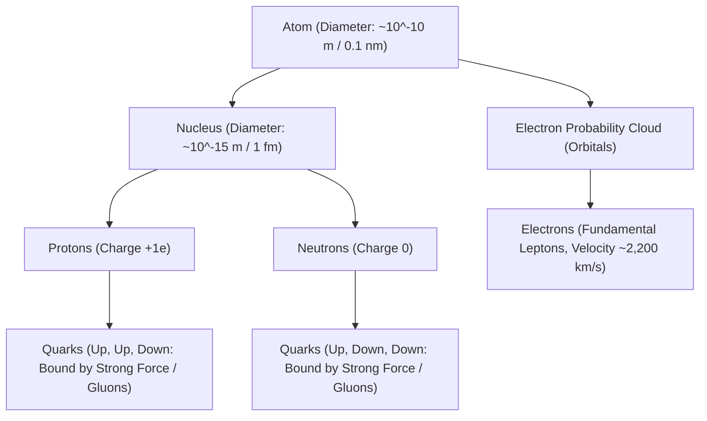

# The Atomic Hypothesis & Quantum Field Foundations

> **Axiomatic Kernel (Feynman's Invariant)**: All physical matter in the universe is composed of discrete, indivisible quantum excitations (atoms and subatomic particles) that attract across short distances through fundamental gauge fields and resist interpenetration due to Pauli Exclusion.

---

## 1. The Scale & Geometry of Atomic Architecture



### Key Physical Invariants
1. **The Extreme Scale Ratio ($10^5 : 1$)**: The atomic radius is approximately $100,000\text{ times}$ larger than the nucleus. If an atom were expanded to the size of a cathedral or football stadium, the nucleus would be a marble at the 50-yard line, and the electrons would be probability ripples near the outer dome.
2. **The Vacuum Illusion & Quantum Electrodynamics (QED)**: Over $99.999999999999\%$ of the atomic volume is devoid of classical mass. However, this is not "empty space"; it is a dynamic medium permeated by **zero-point quantum vacuum fluctuations** and virtual particle exchanges governed by Heisenberg's Uncertainty Principle:
\[
\Delta E \cdot \Delta t \ge \frac{\hbar}{2}
\]

---

## 2. Wave-Particle Duality & Orbitals

Electrons do not orbit like classical planets; they exist as stationary quantum wave functions $\psi(\mathbf{r}, t)$ whose square modulus $|\psi(\mathbf{r})|^2$ defines a three-dimensional **Probability Density Cloud**:

```mermaid
graph LR
    WaveFunction["Quantum Wave Function: ψ(r, t)"] -->|Born Rule: |ψ|²| ProbabilityDensity["Probability Density Cloud (|ψ|² > 0)"]
    ProbabilityDensity --> Orbitals["Atomic Orbitals (s, p, d, f)"]
    Orbitals --> ChemicalBonding["Chemical Reactivity & Molecular Geometry"]
```

* **Non-Zero Universal Tail**: The probability of finding an electron drops exponentially with distance ($r$) from the nucleus according to $|\psi|^2 \propto e^{-2r/a_0}$, but strictly never reaches absolute mathematical zero—meaning theoretically, a bound electron's probability wave extends across the cosmos.

---

## 3. Tree Linkages
- **Trunk**: [[degenerate-matter-and-extreme-cosmic-density]]
- **Branches**: [[standard-model-and-particle-physics-taxonomy]]
- **Leaves**: [[kurzgesagt-quantum-atomic-scale-feynman]]
