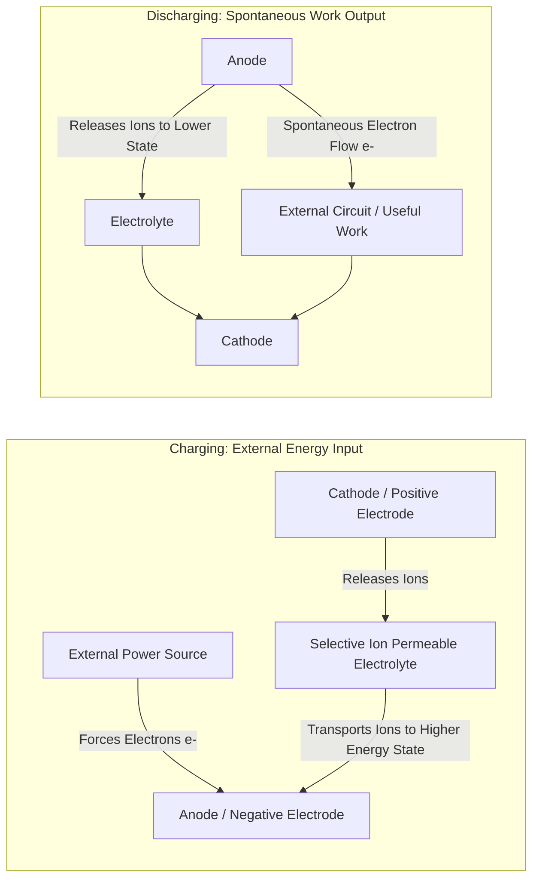

# Electrochemical Energy Storage — First Principles & Axiomatic Foundations

> **Axiomatic Kernel**: A battery does not generate energy; it reversibly converts electrical potential into chemical potential by separating ions through an electrolyte while routing electrons through an external circuit.

---

## 1. The First-Principles Mechanics

### The Irreducible Dynamics
1. **The Potential Well**: During charging, an external voltage forces mobile ions ($\text{Li}^+$, $\text{Na}^+$, $\text{H}^+$) from a thermodynamically stable low-energy state in the cathode across an ion-conducting separator into a higher-energy interstitial matrix in the anode.
2. **The Charge Separation Invariant**: The electrolyte and separator must be an **ionic conductor** but an **electronic insulator**. If electrons pass directly through the electrolyte internally, a short circuit occurs, dissipating stored energy instantly as heat.
3. **The Discharge Spontaneity**: When the external circuit closes, electrons spontaneously flow through the load to equalize the electrochemical potential difference (Gibbs Free Energy $\Delta G = -nFE$), while ions travel back through the electrolyte to maintain internal charge neutrality.

---

## 2. Senior Auditor Gap-Fulfillment & Physics Context

> [!NOTE]
> **Epistemic Context**: All electrochemical systems are bounded by the **Nernst Equation** and Faraday's Laws of Electrolysis. The maximum theoretical energy density is strictly dictated by:
> 1. **Electrochemical Potential Gap ($\Delta V$)**: The difference in standard reduction potentials ($E^\circ$) between cathode and anode materials.
> 2. **Equivalent Weight ($M/z$)**: The atomic mass of the charge carrier per electron transferred.

### Why Lithium & Sodium Dominate Group 1 Chemistry
* **Lithium ($Z=3, 6.94\text{ g/mol}$)**: Lowest standard reduction potential ($-3.04\text{ V}$ vs SHE), yielding the highest voltage gap and highest volumetric/gravimetric energy density.
* **Sodium ($Z=11, 22.99\text{ g/mol}$)**: Slightly higher reduction potential ($-2.71\text{ V}$), larger ionic radius ($1.02\text{ Å}$ vs $0.76\text{ Å}$ for $\text{Li}^+$), which causes lower energy density but enables orders-of-magnitude higher raw material abundance in Earth's crust ($2.8\%$ Na vs $0.002\%$ Li).

---

## 3. Tree Linkages
- **Trunk**: [[battery-tradeoff-trilemma-and-thermal-runaway]]
- **Branches**: [[energy-storage-chemistries-lfp-sodium-nickel-hydrogen]]
- **Leaves**: [[podcast-enervenue-hina-nikhil-kamath-batteries]]
