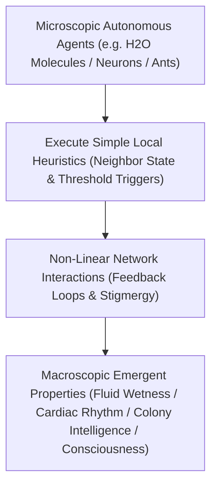

# Emergence Invariants, Stigmergy & Local Rule Networks

> **Axiomatic Kernel (Complex Adaptive Systems)**: Macroscopic intelligence, self-organization, and novel physical properties are not programmed top-down; they emerge spontaneously from the non-linear local interactions of simple agents following decentralized behavioral heuristics (**"More is Different"**).

---

## 1. Mathematical Formalism: Microscopic Rules to Macroscopic Order

### Key Analytical Principles
1. **Anderson's Law ("More is Different", 1972)**: At each level of scale and complexity, entirely new physical laws and ontological properties appear that cannot be deduced solely by reconstructing the properties of isolated microscopic components.
2. **The Wetness Invariant**: A single $H_2O$ molecule has no property called "wetness". Wetness is an emergent, macroscopic fluid phenomenon generated exclusively by the collective hydrogen-bonding network and surface tension of $10^{23}$ interacting molecules.
3. **Stigmergy & Threshold Dynamics**: Agents modify their immediate local environment (e.g. chemical pheromone trails, local voltage gradients), and other agents respond to those local cues. Macro-level task allocation balances automatically via encounter frequency thresholds:
\[
P(\text{Switch Task}) = \frac{(\text{Demand})^n}{(\text{Demand})^n + (\text{Threshold})^n}
\]

---

## 2. Senior Auditor Annotations & The Reductionist Boundary

> [!NOTE]
> **The Reductionist Fallacy**: Reductionism succeeds in breaking complex systems down into their elemental constituents (quarks, nucleotides, transistors), but fails to explain how those constituents organize into self-repairing cells, financial markets, or subjective consciousness. Emergence is the complementary synthesis engine of reality.

---

## 3. Tree Linkages
- **Trunk**: [[emergence-reductionism-and-informational-biology]], [[decentralized-superorganisms-and-swarm-intelligence]]
- **Branches**: [[complex-adaptive-systems-and-cellular-automata]]
- **Leaves**: [[kurzgesagt-emergence-how-stupid-things-become-smart]]
