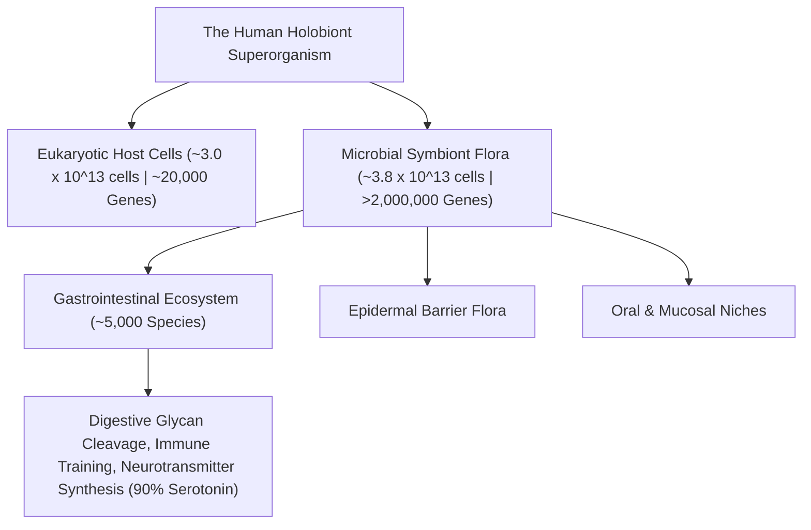

# Holobiont Theory, Symbiogenesis & The Human Metagenome

> **Axiomatic Kernel (Evolutionary Biology)**: A multicellular organism is not an autonomous genetic individual, but a **Holobiont**—an integrated meta-organism composed of a macroscopic eukaryotic host and trillions of symbiotic, co-evolved microscopic organisms ($>3.8 \times 10^{13}$ bacteria). Over $99\%$ of the distinct functional genetic repertoire expressed within a human body is encoded by its microbial symbionts.

---

## 1. The Metagenomic & Cellular Architecture

### Invariant Principles
1. **The Inoculation Invariant**: Mammals are gestated in sterile amniotic environments. Passage through the maternal vaginal birth canal and ingestion of **Human Milk Oligosaccharides (HMOs)**—complex sugars unassimilable by human infants that selectively nourish *Bifidobacterium infantis*—constitute an indispensable evolutionary inoculation program.
2. **Metagenomic Dominance**: While the human genome contains $\approx 20,000$ protein-coding genes, the collective gut microbiome metagenome encodes upwards of **$2,000,000\text{ to } 8,000,000$ unique genes**, performing essential metabolic, vitamin-synthesizing ($B_{12}, K$), and xenobiotic-detoxifying pathways.

---

## 2. Senior Auditor Annotations & The Dysbiosis Trap

> [!NOTE]
> **Lynn Margulis's Legacy**: Just as eukaryotic cells originated via ancient bacterial endosymbiosis (mitochondria), complex mammalian physiology is structurally dependent on continuous microbial co-metabolism. Disruption of this ancient contract via indiscriminate broad-spectrum antibiotics or ultra-processed fiber-depleted diets triggers systemic chronic inflammatory dysbiosis.

---

## 3. Tree Linkages
- **Trunk**: [[gut-brain-axis-neurochemistry-and-feedback-cravings]], [[emergence-reductionism-and-informational-biology]]
- **Branches**: [[microbial-ecology-dysbiosis-and-fecal-transplants]]
- **Leaves**: [[kurzgesagt-microbiome-gut-brain-axis]]
