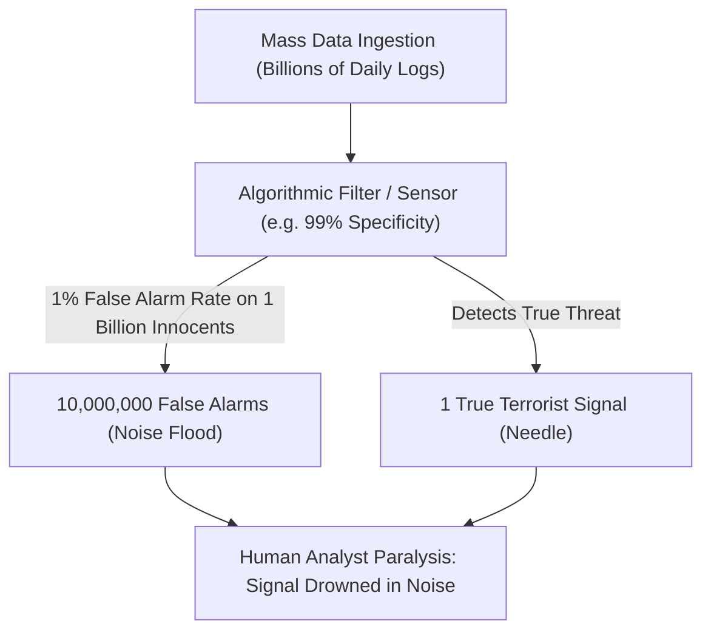

# Signal Detection Theory, Base Rate Fallacy & The Haystack Invariant

> **Axiomatic Kernel (Information Theory)**: In rare-event detection, indiscriminately expanding the data ingestion volume (adding more "hay") without increasing the diagnostic specificity of the sensor exponentially increases false positives, paralyzing investigative processing capacity.

---

## 1. Mathematical Formalism: Bayesian Rare Event Detection

Let $T$ be the rare event (e.g. terrorist conspiracy, $P(T) \approx 10^{-7}$) and $D$ be an automated surveillance alarm/flag.

### The Base Rate Paradox (Bayes' Theorem)
\[
P(T \mid D) = \frac{P(D \mid T) \cdot P(T)}{P(D \mid T) \cdot P(T) + P(D \mid \neg T) \cdot P(\neg T)}
\]
* Even if an automated dragnet algorithm has an exceptional $99.9\%$ accuracy ($P(D \mid T) = 0.999$) and a microscopic $0.1\%$ false positive rate ($P(D \mid \neg T) = 0.001$):
* On a population of 300 million citizens ($3 \times 10^8$), the system generates **300,000 false positive alerts** for every single true threat detected.
* **The Haystack Invariant**: Ingesting bulk citizen metadata does not illuminate the needle; it builds an exponentially larger haystack that exhausts human investigative bandwidth.

---

## 2. Senior Auditor Annotations & Real-World Intelligence Failures

> [!NOTE]
> **Empirical Validation**: Declassified reviews of the NSA's Section 215 bulk telephony metadata collection (post-Snowden PCLOB report) concluded that dragnet surveillance **failed to prevent a single catastrophic terrorist attack**. In nearly all major attacks (e.g. 2013 Boston Marathon bombing, 2015 Paris attacks), the perpetrators were already known subjects of prior targeted law enforcement inquiries that were dropped due to analyst overload and misallocated resources.

---

## 3. Tree Linkages
- **Trunk**: [[surveillance-function-creep-and-ratchet-effect]]
- **Branches**: [[cryptographic-asymmetry-and-systemic-backdoors]]
- **Leaves**: [[kurzgesagt-surveillance-terrorism-civil-liberties]]
