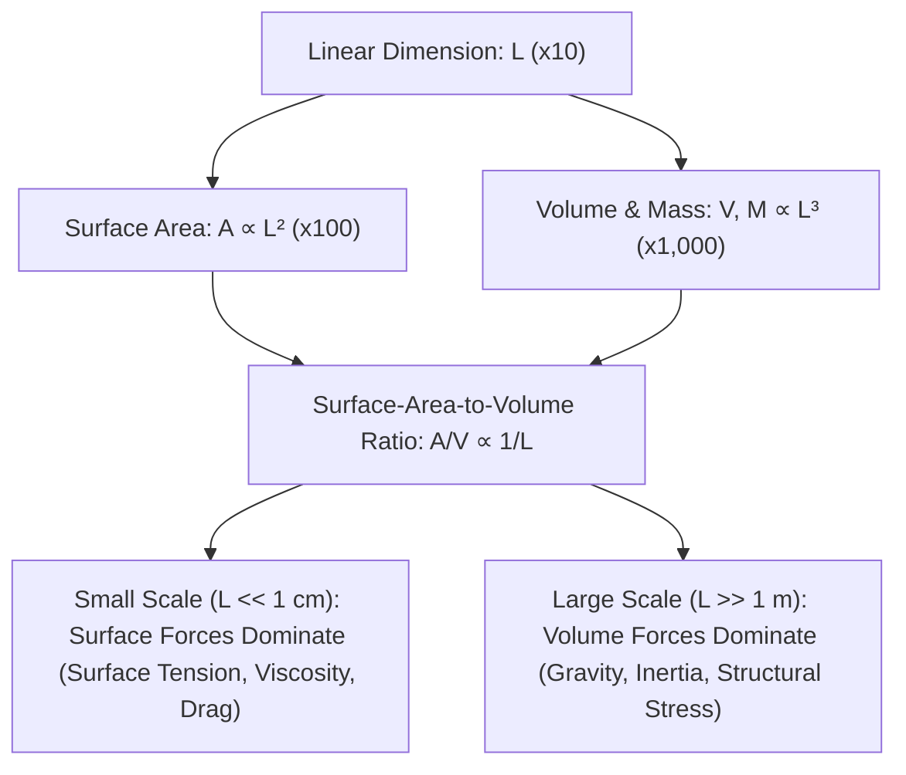

# The Square-Cube Law & Allometric Dimensional Scaling

> **Axiomatic Kernel (Galilean Dimensional Scaling)**: When an organism or physical structure scales uniformly by a linear factor of $L$, its surface area scales quadratically ($A \propto L^2$), while its volume and mass scale cubically ($V, M \propto L^3$). Consequently, the surface-area-to-volume ratio decays inversely with size ($\frac{A}{V} \propto \frac{1}{L}$), fundamentally altering the governing physical forces at each biological scale.

---

## 1. Mathematical Formalism: Dimensional Scaling Ratios

### Governing Force Scaling Equations
1. **Gravitational Weight ($F_g$)**:
\[
F_g = M \cdot g \propto \rho L^3 g \propto L^3
\]
2. **Surface Tension Force ($F_\gamma$)**:
\[
F_\gamma = \gamma \cdot \text{Perimeter} \propto \gamma L \propto L^1
\]
3. **Aerodynamic Drag Force ($F_d$)**:
\[
F_d = \frac{1}{2} \rho_{\text{air}} v^2 C_d A \propto L^2
\]
4. **Terminal Velocity ($v_t$)**:
\[
v_t = \sqrt{\frac{2 M g}{\rho_{\text{air}} C_d A}} \propto \sqrt{\frac{L^3}{L^2}} \propto \sqrt{L}
\]
5. **Kinetic Energy at Impact ($E_k$)**:
\[
E_k = \frac{1}{2} M v_t^2 \propto (L^3) \cdot (\sqrt{L})^2 \propto L^4
\]
6. **Impact Stress per Unit Area ($\sigma_{\text{impact}}$)**:
\[
\sigma_{\text{impact}} = \frac{E_k}{A} \propto \frac{L^4}{L^2} \propto L^2
\]

---

## 2. Senior Auditor Annotations & Haldane's Principle

> [!NOTE]
> **J.B.S. Haldane's Invariant (1926)**:
> *"You can drop a mouse down a thousand-yard mine shaft; and, on arriving at the bottom, it gets a slight shock and walks away... A rat is killed, a man is broken, a horse splashes."*
> Because impact stress scales as $\sigma \propto L^2$, smaller animals absorb exponentially less kinetic damage per unit bone cross-section, rendering insects and small rodents virtually immune to fatal falls.

---

## 3. Tree Linkages
- **Trunk**: [[physical-regimes-across-scales-viscosity-to-gravity]]
- **Branches**: [[allometric-biomechanics-reynolds-numbers-plastrons]]
- **Leaves**: [[kurzgesagt-size-square-cube-law-elephant]]
