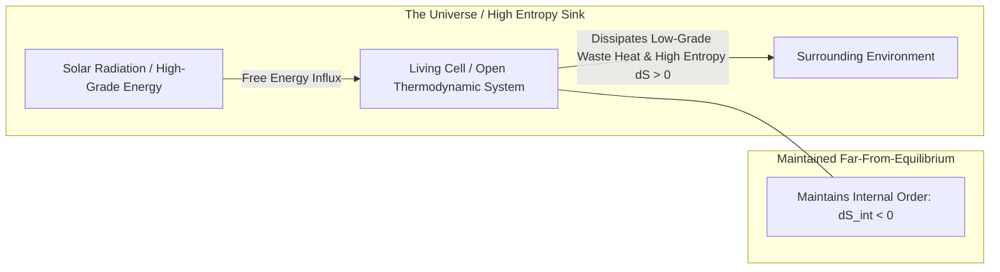

# Thermodynamic Entropy & Schrödinger's Negentropy — The Physics of Life

> **Axiomatic Kernel**: A living system is a localized, non-equilibrium open thermodynamic structure that temporarily evades decay into maximum entropy (equilibrium) by continually drawing "negative entropy" (free energy) from its environment and dissipating waste heat.

---

## 1. The Physical Invariant (Schrödinger's Formulation)

In 1944, physicist Erwin Schrödinger posed the foundational question: *How does a living organism avoid immediate decay into the chaotic equilibrium dictated by the Second Law of Thermodynamics?*

### The Thermodynamic Balance Equation
\[
\frac{dS_{\text{total}}}{dt} = \frac{dS_{\text{internal}}}{dt} + \frac{dS_{\text{external}}}{dt} \ge 0
\]
* $\frac{dS_{\text{internal}}}{dt} < 0$: The living organism continuously repairs, organizes, and reduces its internal disorder.
* $\frac{dS_{\text{external}}}{dt} > 0$: To pay for internal order, the organism pumps out a greater amount of entropy into the surrounding universe.
* **Death defined physically**: The cessation of free energy intake, causing internal entropy production to drive the system to maximum thermodynamic equilibrium ($\Delta G = 0$, complete molecular disorder).

---

## 2. Senior Auditor Annotations & Ilya Prigogine's Dissipative Structures

> [!NOTE]
> **Prigogine's Extension**: Nobel laureate Ilya Prigogine proved that non-linear, non-equilibrium systems naturally undergo self-organization into **Dissipative Structures** (e.g., Bénard convection cells, hurricanes, living cells). Life is not a violation of the Second Law of Thermodynamics; it is the universe's most efficient engine for accelerating overall cosmic entropy production.

---

## 3. Tree Linkages
- **Trunk**: [[emergence-reductionism-and-informational-biology]]
- **Branches**: [[definition-of-life-and-artificial-life]]
- **Leaves**: [[kurzgesagt-schrodinger-what-is-life-death]]
