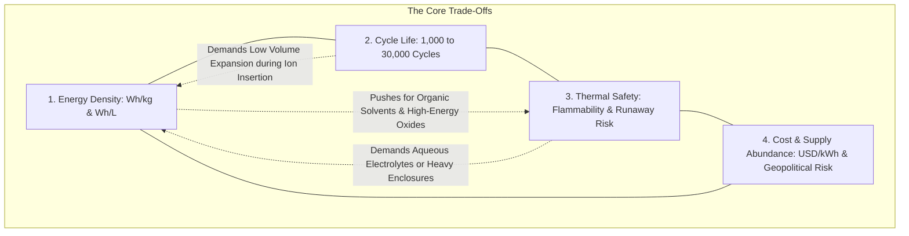

# The Battery Trade-Off Quadrilemma & Thermal Runaway Dynamics

> **System Invariant**: There is no universally superior battery cell. Battery engineering is a constrained optimization problem balancing four interdependent variables: Energy Density, Cycle Life, Thermal Safety, and Precursor Cost/Supply Chain Decoupling.

---

## 1. The Multi-Dimensional Trade-Off Matrix



| Dimension | Mobile / Automotive Focus (EVs) | Stationary Grid & AI Data Center Focus |
| :--- | :--- | :--- |
| **Primary Constraint** | **Gravimetric & Volumetric Density** ($>160\text{ Wh/kg}$) | **Levelized Cost of Storage (LCOS)** & Zero Downtime |
| **Acceptable Trade-off** | Lower cycle life ($1,000-2,000$ cycles), higher fire risk mitigation | Heavy footprint, lower gravimetric density |
| **Optimal Chemistries** | LFP, NMC, Solid-State (Future) | Sodium-Ion ($\text{Na-ion}$), Nickel-Hydrogen ($\text{Ni-H}_2$), Flow Batteries |

---

## 2. Thermal Runaway: The Self-Accelerating "Fever Spiral"

When a battery enters thermal runaway, it transitions from a controlled electrochemical device to a self-fuelling chemical fire:

```mermaid
sequenceDiagram
    participant Trigger as Internal/External Trigger (Dendrite / Overheating / Impact)
    participant SEI as Solid Electrolyte Interphase (SEI)
    participant Solvent as Organic Liquid Solvent (Carbonates)
    participant Cathode as Cathode Lattice (Oxygen Release)
    participant Fire as Uncontrolled Thermal Runaway (>600°C)

    Trigger->>SEI: Local temperature reaches 80°C - 120°C
    SEI->>SEI: Exothermic SEI decomposition starts self-heating
    SEI->>Solvent: Temperature reaches 130°C - 150°C; Separator melts
    Solvent->>Cathode: Massive internal short circuit releases extreme heat
    Cathode->>Fire: Cathode releases free O2 into boiling organic solvent
    Fire-->>Fire: Self-sustaining combustion without atmospheric air (Cannot be suffocated)
```

### Why Thermal Runaway Defies Conventional Firefighting
1. **Internal Oxygen Generation**: High-energy oxide cathodes decompose at elevated temperatures and release molecular oxygen ($\text{O}_2$) internally into the hot flammable electrolyte solvent.
2. **Chain Propagation**: The heat from one failing cell breaches the thermal barrier of neighboring cells in a pack, causing a cascading detonation of the entire pack or container.
3. **The 2025 Empirical Reality**: As highlighted in industry data, over **14,000 LFP fire incidents** occurred globally in 2025 across automotive and stationary systems, disproving the myth that LFP is completely fireproof.

---

## 3. Senior Auditor Annotations & Engineering Mitigations

> [!IMPORTANT]
> **Production Quality vs. Chemistry**: Safety is not solely chemistry-dependent; it is heavily dictated by manufacturing cleanliness. A single microscopic metal particle or electrode burr ($<10\mu\text{m}$) in a Tier-2 factory will cause dendrite growth and catastrophic internal short-circuits, explaining why Tier-1 manufacturers (CATL, BYD) command a $10-15\%$ premium over Tier-2 producers.

---

## 4. Tree Linkages
- **Roots**: [[electrochemical-energy-storage-axioms]]
- **Branches**: [[energy-storage-chemistries-lfp-sodium-nickel-hydrogen]]
- **Leaves**: [[podcast-enervenue-hina-nikhil-kamath-batteries]]
