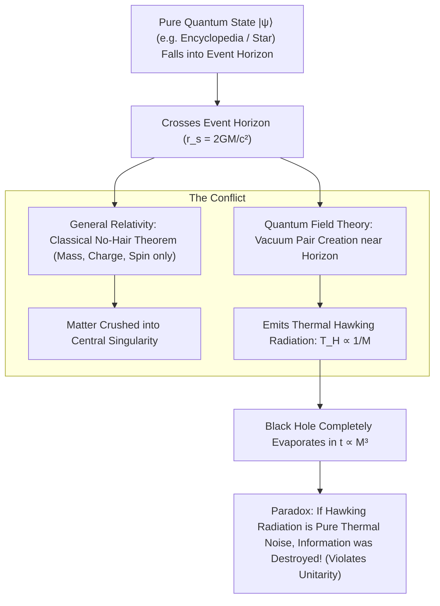

# The Black Hole Information Paradox & Bekenstein-Hawking Entropy

> **System Invariant**: Black holes are not infinitely dense bottomless pits, but the ultimate maximum-entropy information storage drives in the cosmos. Their maximum information capacity scales strictly with the **surface area of the event horizon** ($S_{BH} \propto A$) rather than their interior volume, with exactly one bit of quantum information encoded per four Planck areas ($4\ell_P^2$).

---

## 1. The Paradox Architecture: Relativity vs. Quantum Mechanics

### The Governing Equations
1. **Hawking Temperature ($T_H$)**:
\[
T_H = \frac{\hbar c^3}{8 \pi G M k_B}
\]
2. **Bekenstein-Hawking Entropy ($S_{BH}$)**:
\[
S_{BH} = \frac{k_B c^3 A}{4 G \hbar} = \frac{k_B A}{4 \ell_P^2} \quad \left(\text{where } \ell_P = \sqrt{\frac{G\hbar}{c^3}} \approx 1.616 \times 10^{-35}\text{ m}\right)
\]
3. **The Bekenstein Bound**:
\[
S \le \frac{2 \pi k_B R E}{\hbar c}
\]
A black hole represents the absolute physical upper limit of entropy and information that can be packed into any region of space.

---

## 2. Area vs. Volume: The 2D Information Inversion

* **The Laundry Basket Thought Experiment**: Normal everyday objects store information in volume ($V \propto L^3$). If you stuff socks into a room, maximum storage depends on room volume.
* **The Gravitational Collapse Transition**: If you compress matter past its Schwarzschild radius ($r_s$), the interior collapses into a black hole. Adding more information does not expand interior capacity; it **expands the 2D surface area of the event horizon** by $\Delta A \propto 4\ell_P^2$ per bit.

---

## 3. Tree Linkages
- **Roots**: [[quantum-unitarity-and-information-conservation]], [[thermodynamics-entropy-and-schrodinger-negentropy]], [[atomic-hypothesis-quantum-fields-scale]]
- **Branches**: [[holographic-principle-and-quantum-gravity]]
- **Leaves**: [[kurzgesagt-black-hole-information-paradox]]
