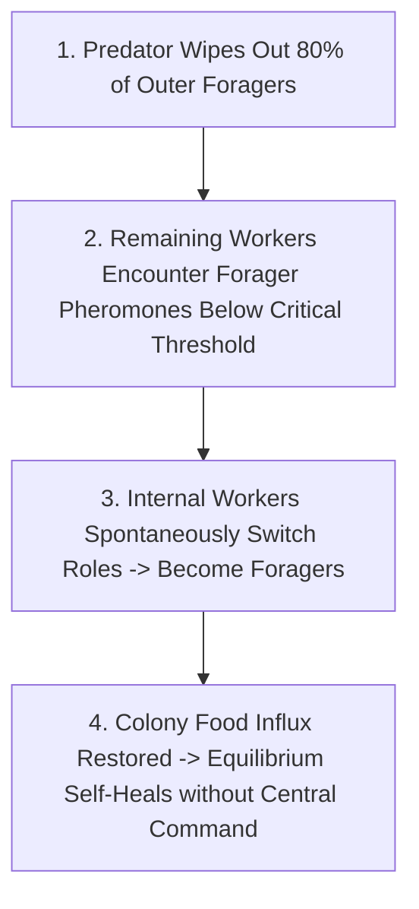
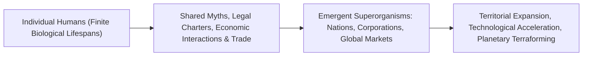

# Decentralized Superorganisms, Phase Synchronization & Swarm Intelligence

> **System Invariant**: High-order systemic optimization, resilient division of labor, and collective survival do not require a central command executive. Decentralized networks achieve dynamic equilibrium through **stigmergy, local threshold response, and phase-locking synchronization**.

---

## 1. Decentralized Task Allocation: The Ant Colony Superorganism

### The Invariant Mechanisms
1. **Olfactory Encounter Frequency**: Ants do not receive orders from the queen (who functions solely as an egg-laying ovary, not an executive general). Workers maintain continuous memory of recent encounter rates with distinct task-specific cuticular hydrocarbons.
2. **Phase Synchronization (Cardiac Pacemaker Cells)**:
   * Billions of cardiomyocytes in the human sinoatrial node fire synchronously ($60-100\text{ BPM}$) through electrical gap junctions via the **Kuramoto Coupled Oscillator Model**:
\[
\frac{d\theta_i}{dt} = \omega_i + \frac{K}{N} \sum_{j=1}^N \sin(\theta_j - \theta_i)
\]
   * When coupling strength $K$ exceeds a critical threshold, individual uncoordinated cells spontaneously lock into a single coherent rhythmic heartbeat.

---

## 2. Anthropological Superorganisms: Nations, Corporations & Cities

* **The Reality of Non-Physical Entities**: A nation or corporation has no physical skull, nervous system, or single beating heart. Yet, it possesses legal identity, holds property, wage wars, and adapts across centuries as individual constituent humans cycle through birth and death.

---

## 3. Tree Linkages
- **Roots**: [[emergence-invariants-and-local-rule-networks]], [[holobiont-theory-and-symbiogenesis-invariants]]
- **Branches**: [[complex-adaptive-systems-and-cellular-automata]]
- **Leaves**: [[kurzgesagt-emergence-how-stupid-things-become-smart]]
