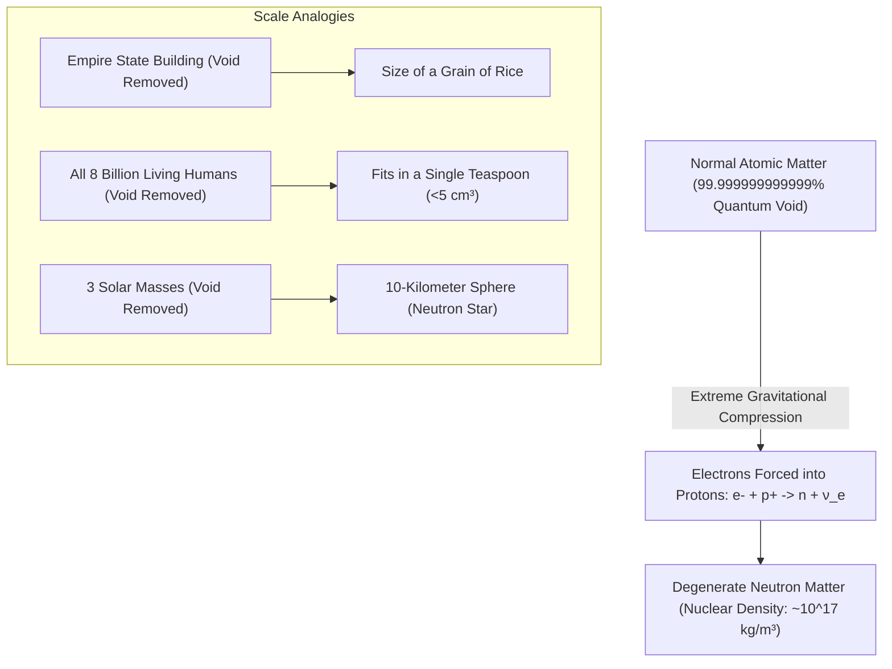

# Degenerate Matter, Extreme Cosmic Density & Quantum Indistinguishability

> **System Invariant**: Normal solid matter's rigidity and volume are not produced by physical contact of solid spheres, but by the electrostatic repulsion of electron clouds and the Pauli Exclusion Principle. When gravity overcomes degeneracy pressure, atomic voids vanish, collapsing massive stellar objects into nuclear fluid.

---

## 1. The Void Removal Gedankenexperiments

### The Quantum Mechanism
1. **Pauli Exclusion Principle**: No two identical fermions (electrons, protons, neutrons) can occupy the same quantum state simultaneously ($\Delta x \cdot \Delta p \ge \frac{\hbar}{2}$).
2. **Electron Degeneracy Pressure**: Resists gravitational collapse in white dwarfs ($P \propto \rho^{5/3}$).
3. **Neutronization**: When gravitational pressure exceeds the Chandrasekhar limit ($\approx 1.44 M_\odot$), electrons are forced into atomic nuclei, combining with protons to form pure neutron degenerate matter ($1\text{ teaspoon} \approx 6\text{ billion tons}$).

---

## 2. Universal Indistinguishability of Elementary Particles

* **Zero Individuality**: In quantum mechanics, every electron in the universe possesses the exact same mass ($9.109 \times 10^{-31}\text{ kg}$), charge ($-1.602 \times 10^{-19}\text{ C}$), and spin ($\frac{1}{2}\hbar$).
* **John Wheeler's Single-Electron Universe**: Because all electrons are quantum-mechanically indistinguishable, physicist John Wheeler famously conjectured to Richard Feynman that all electrons in the cosmos could be the exact same single particle tracing a hyper-dimensional worldline forward and backward in time.
* **Metacognitive Implication**: The hydrogen atoms composing the neural pathways of your brain are structurally identical to the hydrogen atoms currently fusing in the core of the Sun.

---

## 3. Tree Linkages
- **Roots**: [[atomic-hypothesis-quantum-fields-scale]], [[thermodynamics-entropy-and-schrodinger-negentropy]]
- **Branches**: [[standard-model-and-particle-physics-taxonomy]]
- **Leaves**: [[kurzgesagt-quantum-atomic-scale-feynman]]
