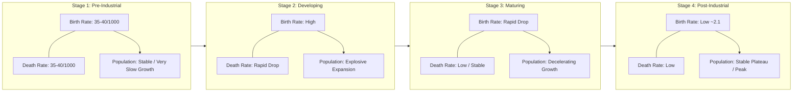

# Demographic Momentum, Fertility Collapse & The 4-Stage Transition Model

> **System Invariant**: Population growth exhibits **Demographic Momentum**: even after fertility drops to replacement levels ($2.1$), overall population continues to expand for several decades due to the large cohort of historical youth reaching reproductive age. Once this demographic wave passes, population growth decelerates permanently.

---

## 1. The 4 Stages of the Demographic Transition Model (DTM)

### Stage-by-Stage Causal Mechanisms
1. **Stage 1 (Pre-1750 UK / Historical Baseline)**: Women have 4–6 children, but infectious disease and malnutrition result in only $\approx 2$ reaching adulthood.
2. **Stage 2 (Industrial Revolution 1750–1850)**: Basic water sanitation, soap, refrigeration, and antibiotics cause infant and child mortality to collapse. Total population doubles rapidly.
3. **Stage 3 (Social Maturation & Female Emancipation)**: With high child survival certainty, families no longer need insurance births. Female education, workplace entry, and contraception cause birth rates to plunge.
4. **Stage 4 (Modern Equilibrium)**: Low mortality paired with low birth rates achieves stable equilibrium.

---

## 2. Demographic Momentum: The Lag Effect

* **Why does population expand while fertility drops?**
  * In the 1970s and 1980s, high birth rates created an unprecedented demographic wave of children.
  * Today, this massive cohort is in their peak childbearing years ($20-40\text{ years old}$).
  * Even though each woman in this cohort has only **$2.2\text{ children}$** on average (down from $5.0+$), the sheer size of the parental cohort generates a temporary aggregate population surge before stabilizing.

---

## 3. Tree Linkages
- **Roots**: [[demographic-transition-and-logistic-population-dynamics]], [[thermodynamics-entropy-and-schrodinger-negentropy]]
- **Branches**: [[development-economics-tfr-and-peak-humanity]]
- **Leaves**: [[kurzgesagt-overpopulation-demographic-transition]]
