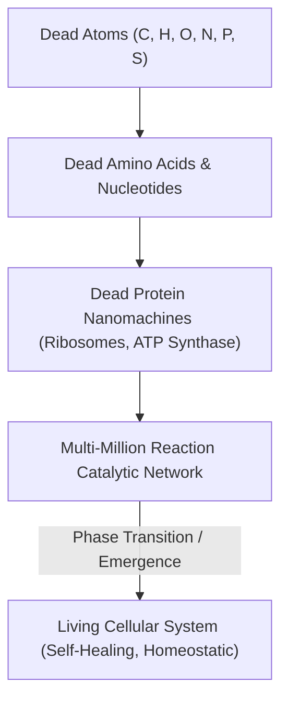
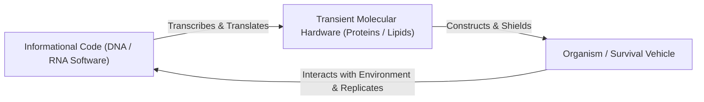
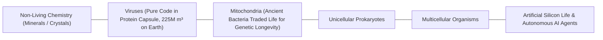

# Emergence, Reductionism & Informational Biology

> **Systemic Thesis**: Life is not a material substance (vitalism is false); it is a computational, emergent process. At the reductionist level, every constituent molecule of a cell is dead matter following blind chemical kinetics. "Aliveness" emerges strictly from dynamic network topology.

---

## 1. The Reductionist Paradox & The "Moving Car" Analogy

### The Continuous Reconstruction Invariant
* In a single eukaryotic cell, millions of chemical reactions occur every second.
* **The Living Machine Analogy**: Imagine a car driving down a highway at $100\text{ km/h}$ while autonomously disassembling and rebuilding every piston, valve, and tire in real time using scrap material scooped from the asphalt. That is the exact molecular reality of cellular metabolism.
* **No Single Living Component**: If you freeze the frame and isolate any single constituent—whether DNA, a ribosome, a lipid membrane, or an ATP molecule—it is purely inanimate chemical matter.

---

## 2. The Informational Code Paradigm (DNA as Software)

* **The Informational Vehicle**: An organism can be viewed as temporary biological hardware engineered to replicate, preserve, and transmit informational software (DNA).
* **The Teleonomy of Replication**: Evolution selects for informational code that constructs vehicles capable of persisting against thermodynamic decay long enough to replicate.

---

## 3. The Spectrum of Life: Boundary Dissolution

The boundary between "living" and "non-living" is a human semantic convention, not a discrete ontological divide:

1. **Viruses ($225,000,000\text{ m}^3$ on Earth)**: Inactive crystals outside a host, active self-replicating programs inside a host. Some giant viruses even possess viral immune systems (virophages).
2. **Mitochondria (Endosymbiosis)**: Originally autonomous free-living proteobacteria that merged with ancestral eukaryotic cells. They surrendered metabolic autonomy to guarantee DNA propagation, effectively transitioning from "independent life" to "organelle."
3. **Computer Viruses & Artificial Life**: Algorithms that exhibit self-replication, mutation, environment-responsiveness, and adaptation inside digital environments.

---

## 4. Tree Linkages
- **Roots**: [[thermodynamics-entropy-and-schrodinger-negentropy]], [[electrochemical-energy-storage-axioms]]
- **Branches**: [[definition-of-life-and-artificial-life]]
- **Leaves**: [[kurzgesagt-schrodinger-what-is-life-death]]
