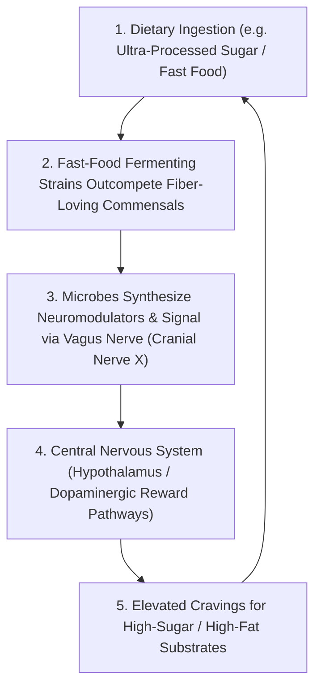

# The Gut-Brain Axis, Enteric Neurochemistry & Feedback Craving Loops

> **System Invariant**: Human cognitive, emotional, and dietary preferences are not generated in neurological isolation. The **Enteric Nervous System (ENS)** and gut microbiome communicate with the Central Nervous System via the **Vagus Nerve** and systemic metabolite circulation, producing over $90\%$ of bodily serotonin and executing self-reinforcing behavioral feedback loops.

---

## 1. The Bi-Directional Neurochemical Feedback Loop

### Key Neurobiological Mechanisms
1. **The 90% Serotonin Invariant**: Enterochromaffin cells in the gut lumen, stimulated by microbial metabolites (specifically short-chain fatty acids like butyrate), produce more than **$90\%$ of the human body's serotonin** ($5\text{-HT}$).
2. **Vagal Information Highway**: The Vagus Nerve transmits continuous sensory afferents from the gut lumen directly into the solitary nucleus of the brainstem, bypassing the conscious blood-brain barrier.
3. **Phenotypic Mood Transfers**: Fecal microbiota transplanted from clinically depressed human patients into sterile germ-free mice reliably induces anxiety-like exploratory avoidance and anhedonic depressive behaviors in the animals.

---

## 2. The Ecological Garden Mental Model

* **The Gut as an Adaptive Bioreactor**: What you consume is not merely fuel for yourself; it is the selective growth medium for an internal ecological garden.
  * Ingesting **dietary fiber and prebiotic complex polysaccharides** selects for beneficial commensals producing anti-inflammatory butyrate.
  * Ingesting **excess refined sugar and saturated fats** breeds opportunistic strains that chemically hijack host appetite pathways to perpetuate their preferred nutrient influx.

---

## 3. Tree Linkages
- **Roots**: [[holobiont-theory-and-symbiogenesis-invariants]], [[thermodynamics-entropy-and-schrodinger-negentropy]]
- **Branches**: [[microbial-ecology-dysbiosis-and-fecal-transplants]]
- **Leaves**: [[kurzgesagt-microbiome-gut-brain-axis]]
