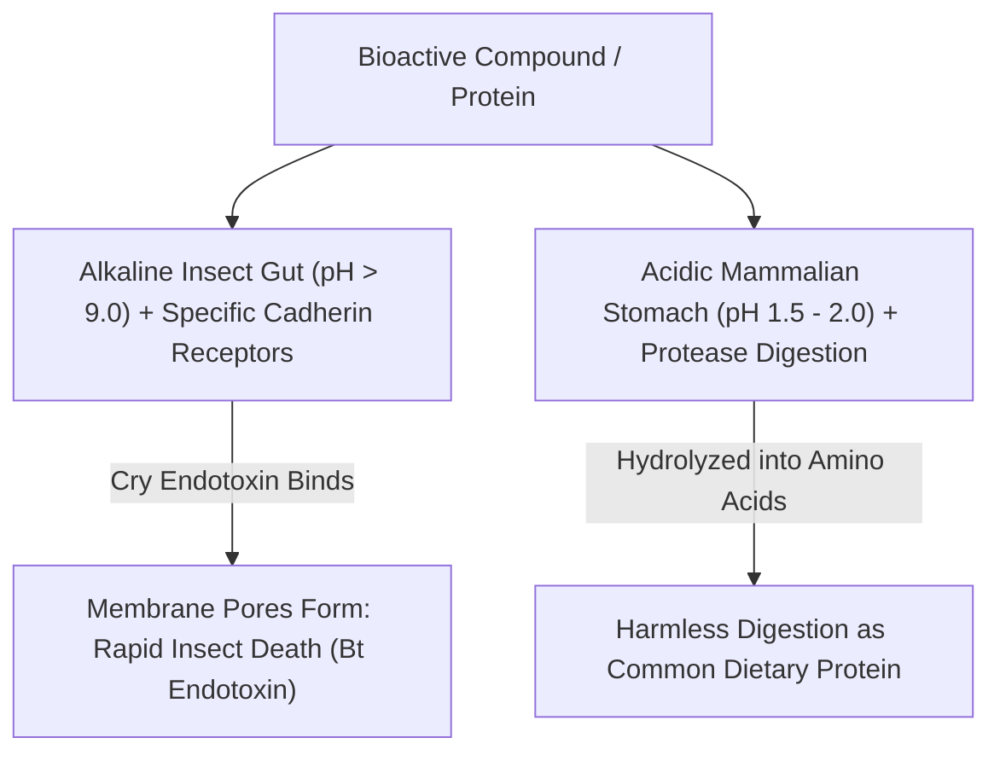

# Selective Toxicity Invariants & The "Appeal to Nature" Fallacy

> **System Invariant**: Toxicity is not an absolute chemical property; it is an **Isomorphic Biological Lock-and-Key Relationship**. A molecule that is acutely lethal to an insect gut receptor can be completely benign and nutritionally digestible to mammalian biology. Furthermore, human selective breeding for 10,000 years has always been genetic modification—modern biotechnology simply eliminates random trial-and-error.

---

## 1. The Selective Toxicity Matrix

| Compound | Target Vulnerability | Mammalian Impact | Ecological / Everyday Analogue |
| :--- | :--- | :--- | :--- |
| **Bt Endotoxin (Cry1Ac)** | Specific midgut cadherin receptors in Lepidopteran pests. | Degraded in acidic stomach ($< \text{pH } 2$) into harmless peptides. | Built-in bio-insecticide; eliminates chemical spraying. |
| **Caffeine** | Potent neurotoxin paralyzing insect feeding mechanisms. | Mild central nervous system adenosine antagonist stimulant. | Natural plant insecticide evolved by coffee and tea plants. |
| **Theobromine** | High metabolic toxicity in dogs and cats (slow hepatic clearance). | Safely metabolized by human liver enzymes ($CYP1A2$). | Everyday chocolate consumption. |

---

## 2. Deconstructing the "Appeal to Nature" Fallacy

* **The Myth of Wild "Natural" Food**: Wild maize (teosinte) was an unchewable, tiny seed head with $8$ hard grains; wild bananas were bitter and packed with large rock-hard seeds; wild watermelons were tiny, pale, and bitter.
* **Selective Breeding as Stochastic Mutagenesis**: Traditional farming selected for random, unmapped genetic mutations over millenia. Precision genetic engineering (transgenics and CRISPR) targets specific alleles with molecular accuracy.
* **Technology vs. Corporate Monopolies**: The valid criticism of modern agriculture—herbicide over-reliance (e.g. glyphosate-resistant monocultures), aggressive seed patent enforcement, and centralized agrochemical cartels—is a flaw of corporate governance and market incentives, not an intrinsic flaw of recombinant DNA science.

---

## 3. Tree Linkages
- **Roots**: [[agricultural-energetics-and-land-sparing-invariants]], [[thermodynamics-entropy-and-schrodinger-negentropy]]
- **Branches**: [[crop-bioengineering-bt-endotoxins-and-biofortification]]
- **Leaves**: [[kurzgesagt-gmo-food-genetic-engineering]]
