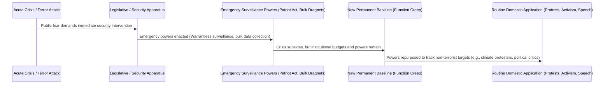

# Surveillance Function Creep, The Ratchet Effect & The "Nothing to Hide" Fallacy

> **System Invariant**: Extraordinary emergency surveillance powers granted to state or corporate actors during crises are subject to the **Institutional Ratchet Effect**: they never revert to baseline; instead, they experience **Function Creep**, expanding from rare external threats into routine domestic policing and social control.

---

## 1. The Institutional Ratchet Mechanism

### Key Dynamics
1. **The Ratchet Effect (Higgs Framework)**: During acute national panic, governments expand legal authority and surveillance footprints. Once the emergency passes, institutional inertia, budget allocations, and vested bureaucratic interests prevent the rollback of those powers.
2. **Function Creep**: Tools designed for extreme threats (e.g. military-grade phone tapping, IMSI-catchers, facial recognition) are rapidly downgraded into routine traffic enforcement, tax audits, and protest surveillance.
3. **The 2015 French State of Emergency Case**: Expanded anti-terror powers (warrantless home raids, pre-emptive house arrests) were actively utilized within weeks to suppress environmental and climate change activists ahead of COP21.

---

## 2. Deconstructing the "Nothing to Hide" Fallacy

The common assertion *"If you have nothing to hide, you have nothing to fear"* suffers from three foundational epistemic flaws:

* **Flaw 1: Equating Privacy with Illegality**: Privacy is not about hiding wrongdoing; it is about maintaining a **boundary of individual autonomy** against external manipulation.
* **Flaw 2: The Power Asymmetry Invariant**: Surveillance is fundamentally about power. When the state or a monopoly tech platform knows everything about an individual while remaining completely opaque itself, democratic accountability collapses.
* **Flaw 3: Changing Norms & Retroactive Weaponization**: Information that is completely benign and legal today can become criminalized or weaponized under future political regimes or policy shifts.

---

## 3. Tree Linkages
- **Roots**: [[signal-detection-theory-and-haystack-fallacy]]
- **Branches**: [[cryptographic-asymmetry-and-systemic-backdoors]]
- **Leaves**: [[kurzgesagt-surveillance-terrorism-civil-liberties]]
