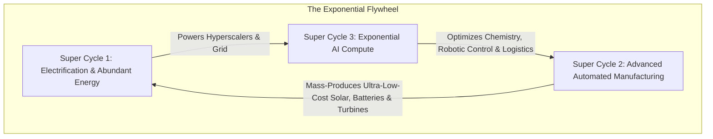
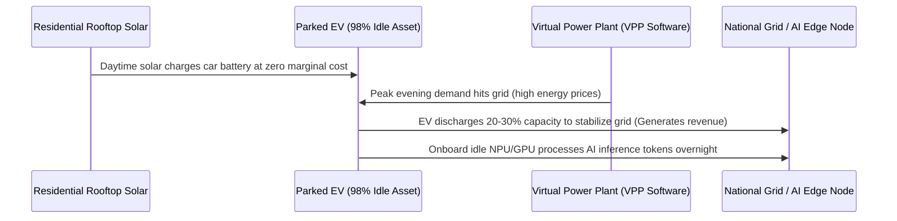

# The Three Converging Super-Cycles: Energy, Manufacturing & AI

> **Macro Thesis**: Global industrial wealth and civilization scaling over the next 30 years will be determined by the intersection of three compounding super-cycles: Abundant Electrification, Autonomous Precision Manufacturing, and Exponential AI Compute.

---

## 1. The Tri-Partite Super-Cycle Engine

### The Three Pillars
1. **Energy (The Input)**: Transition from burning hydrocarbons to marginal-cost-zero generation (Solar + Wind + Long-duration Storage). Massive new load demand ($+1,000\text{ TWh}$ projected by 2030 driven by AI data centers and EV charging).
2. **Manufacturing (The Physical Realization)**: Overcoming global undercapacity in high-speed, automated production lines. Transitioning from labor-intensive assembly to fully robotic gigafactories.
3. **AI Compute (The Optimization Layer)**: Massive silicon demand requiring 24/7 uninterrupted base load without burning diesel or oil.

---

## 2. Decentralization & The Parked Fleet Paradox (V2G)

* **The Asset Inefficiency**: The global private vehicle fleet sits parked and idle **98% of its operational life**.
* **The Dual-Use Edge Asset**:
  1. **Grid Stabilization (V2G)**: Every parked electric vehicle is a mobile $60-100\text{ kWh}$ chemical battery plugged into residential/commercial chargers, capable of peak shaving and grid frequency regulation.
  2. **Decentralized Compute Edge (Token Factory)**: High-performance automotive inference/compute chips running idle can function as distributed micro-data centers, processing edge workloads and local AI inference during off-peak hours.

---

## 3. Geopolitical Supply Chain Paradigm: "Local for Local"

In an era where unipolar globalization is transitioning to multipolar regional competition:
* **The Vulnerability**: Choke points in rare earth mining ($>70\%$ concentrated) and lithium refining ($>60\%$ concentrated in China).
* **The Strategic Playbook**: Build energy architectures using globally ubiquitous precursors ($\text{Na}_2\text{CO}_3$, Iron, Nickel, Water) that can be sourced and manufactured within domestic borders, eliminating dependency on foreign export bans or tariffs.

---

## 4. Tree Linkages
- **Roots**: [[electrochemical-energy-storage-axioms]]
- **Trunk**: [[battery-tradeoff-trilemma-and-thermal-runaway]]
- **Branches**: [[energy-storage-chemistries-lfp-sodium-nickel-hydrogen]]
- **Leaves**: [[podcast-enervenue-hina-nikhil-kamath-batteries]]
