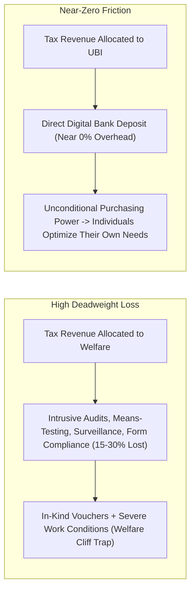

# Unconditional Floors vs. Welfare Cliffs & Administrative Deadweight Loss

> **System Invariant**: Bureaucratic paternalism in means-tested social welfare creates massive **Administrative Deadweight Loss** (15–30% of budget spent on policing recipients) and imposes a **Cognitive Bandwidth Tax** on the poor. Replacing conditional bureaucratic hurdles with an unconditional financial floor optimizes resource allocation and preserves individual agency.

---

## 1. The Administrative Efficiency Comparison

### Key Dynamics
1. **The Cognitive Bandweight Tax (Scarcity Theory)**: Chronic financial insecurity consumes mental processing bandwidth, equivalent to a loss of $13-14\text{ IQ points}$. An unconditional floor frees cognitive capacity for education, entrepreneurship, and long-term career planning.
2. **Labor Supply Elasticity in Practice**: Empirical UBI trials (Canada Mincome, Gary Indiana, GiveDirectly Kenya) reveal that overall workforce participation drops by $<10\%$, with reductions concentrated almost entirely among primary caregivers (mothers with infants) and young adults completing higher education.
3. **Restoring Worker Bargaining Power**: When workers possess a non-withdrawable survival floor, they gain the power to refuse hazardous, exploitative, or sub-minimum-wage conditions, forcing firms to improve wages or automate dangerous tasks.

---

## 2. Tree Linkages
- **Roots**: [[marginal-propensity-to-consume-and-poverty-traps]], [[demographic-transition-and-logistic-population-dynamics]]
- **Branches**: [[universal-basic-income-architectures-and-automation]]
- **Leaves**: [[kurzgesagt-universal-basic-income-ubi]]
